# Cake It Easy v2.0

<a id="top"></a>

## Table of Contents
- [Live Project](#live-project)
- [Business Goals](#business-goals)
- [User Goals](#user-goals)
- [Agile Methodology](#agile-methodology)
- [Design](#design)
- [Data Model / ERD](#data-model--erd)
- [Features](#features)
- [Testing](#testing)
- [Validation](#validation)
- [Deployment](#deployment)
- [Marketing & SEO Evidence](#marketing--seo-evidence)
- [Business Model & UX Rationale](#business-model--ux-rationale)
- [Credits](#credits)
- [Licence](#licence)


Cake It Easy v2.0 is a full‑stack e‑commerce site for ordering cakes, cupcakes, and accessories. It builds on the Code Institute **Boutique Ado** walkthrough and adds:

- **Cupcake box‑size pricing** (4/6/10/12) with transparent per‑cupcake price
- **Custom Cake Orders** (bespoke requests)
- **Discount codes** (e.g., `WELCOME10`)
- **Newsletter signup** modal with success flow
- **SEO** polish (meta, robots, sitemap, rel)

> This README aligns to the assessor feedback and PP5 criteria. See [**TESTING.md**](TESTING.md) for the step‑by‑step test evidence.

[Back to Top](#top)

---

## Live Project

- **Live Site:** [https://cake-it-easy-7700e2082546.herokuapp.com/](https://cake-it-easy-7700e2082546.herokuapp.com/)
- **Repository:** [https://github.com/MaireadKelly/cake\_it\_easy\_v2](https://github.com/MaireadKelly/cake_it_easy_v2)
- **Project Board (Agile):** [https://github.com/users/MaireadKelly/projects/10](https://github.com/users/MaireadKelly/projects/10)

[Back to Top](#top)


---

## Business Goals

- Provide a user‑friendly shop for artisan cakes and cupcakes.
- Make pricing clear: **per‑cupcake** and **per‑box**.
- Enable upsell of accessories (candles, balloons).
- Support admin efficiency with inline product options.
- Drive engagement via newsletter and social content.

[Back to Top](#top)

---

## User Goals

- Browse and search products quickly.
- Understand costs before committing (per cupcake + per box).
- Add/update/remove items easily; see toasts.
- Checkout securely with Stripe.
- Save details and view previous orders.

[Back to Top](#top)

---

## Agile Methodology

- Managed with a GitHub **Project Board** (link above).
- **Epics**: Products, Bag & Checkout, Profiles, Marketing, SEO/Accessibility, Custom Cakes.
- **MoSCoW**
  - **Must**: Product browsing, Bag, Stripe checkout, RBAC, Cupcake box pricing
  - **Should**: Newsletter modal, SEO (meta/robots/sitemap), responsive layout
  - **Could**: Custom Cake Orders
- Each User Story is tracked as a card with acceptance criteria; closed cards map to commits/deploys.

### User Stories (samples)

- As a shopper I can **filter and search** so I see only relevant items.
- As a shopper I can choose a **box size** so I get the right quantity.
- As a shopper I can see a **per‑cupcake** price so pricing is transparent.
- As a shopper I can **apply a discount code** so I can redeem offers.
- As a staff user I can **add/edit product options** so I can manage packs.
- As a returning user I can **view past orders** so I can reorder.

> Full list and status are available on the project board.

[Back to Top](#top)

---

## Design

- **Wireframes** (created in Balsamiq, stored in `docs/readme/`):
  
  
  
  
  

- **Typography:** Poppins, Roboto Condensed (Google Fonts).
- **Colour Palette:** Light bakery palette with strong CTA accents (see [static/css/base.css](static/css/base.css))
.
- **Responsiveness:** Bootstrap 5 grid; mobile nav + stacking forms; no horizontal scroll.

### Data Model / ERD
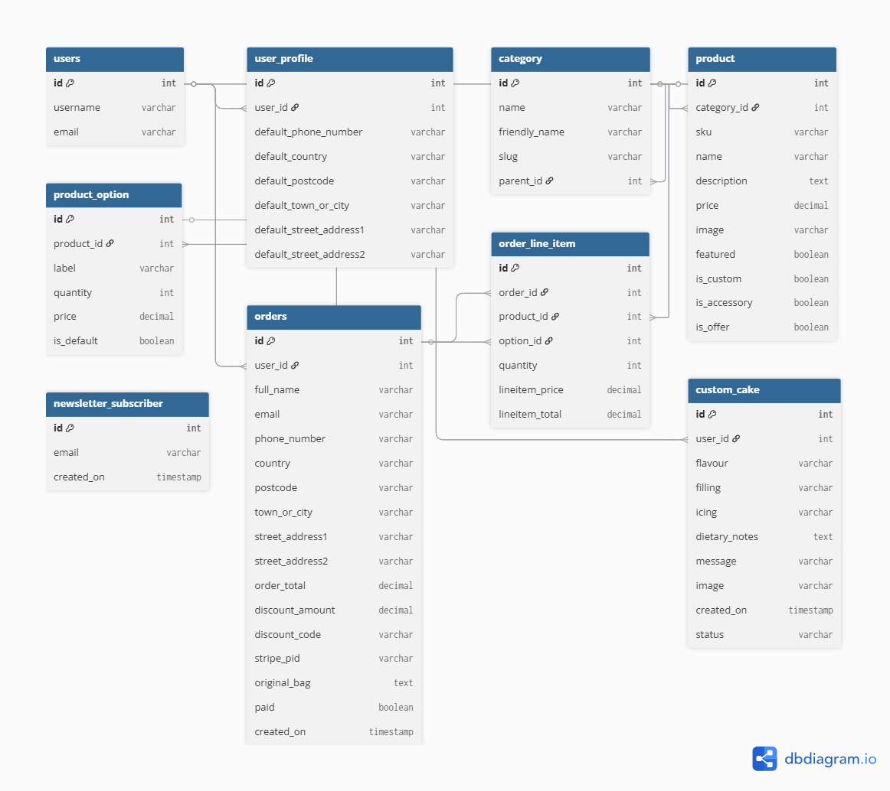

[Back to Top](#top)

---

## Features

### Products & Discovery

- Product list, detail, search, sort, and category filters (Cakes/Accessories/Cupcakes).
- Cupcake cards display **“From €…”** based on the cheapest configured box.


### Cupcake Box‑Size Pricing

- Product detail shows **€X.XX per cupcake**.
- A **Box size** dropdown (4/6/10/12) appears above Quantity (boxes).
- Pack price auto‑calculates from per‑cupcake × quantity (or uses an override price for bundles).
- Bag line shows **(Box of N)** and **≈ € per cupcake**.


### Shopping Bag

- Add, update, remove with toasts; free‑delivery threshold message.
- **Discount codes** (see below) integrated into totals.
- On smaller screens, the bag uses a horizontally scrollable table to ensure all pricing information remains accessible without overcrowding the layout.


### Checkout (Stripe)

- Stripe PaymentIntent uses the **discounted** grand total.
- On success, order is created; bag/discount cleared; success page shown.
- Webhooks ready for robust fulfilment (test mode used).


### Profiles

- Saved default delivery details; order history.


### Order History & Order Details

Registered users can view a full history of their previous orders from their profile page.

For each order, users can:
- View order status (Paid / Unpaid)
- See the order date and Stripe payment reference
- Review all purchased items with quantities and line totals
- Clearly see any applied discount codes and savings
- View the final grand total charged

This allows customers to easily confirm past purchases and provides transparency around pricing and discounts.

**Evidence:**
- 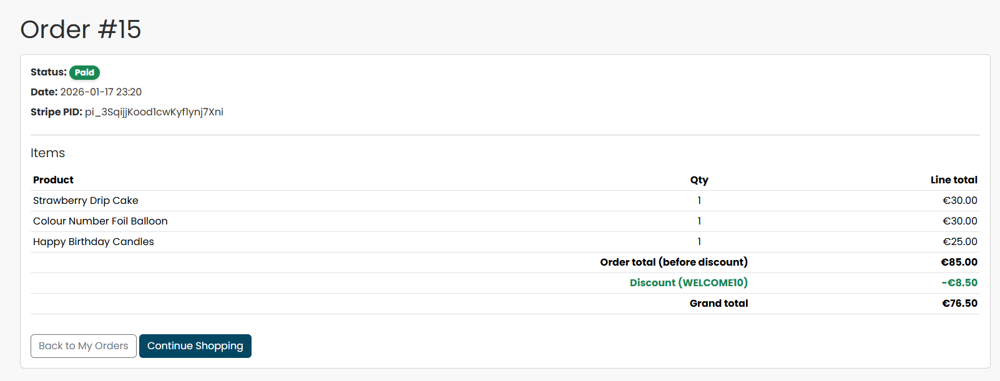

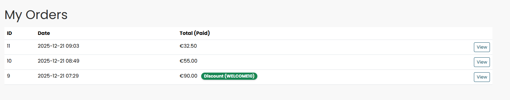

[Back to Top](#top)


### Admin

Administration is handled through the Django Admin panel. Access is restricted to staff/superusers.

- **Product management (admin):**
  - Staff can add/edit/delete products and maintain catalogue content.
  - Product details (name, price, images, categories) are manageable via admin for quick updates.

- **Order management (admin):**
  - Orders are visible to staff for fulfilment, including customer contact and delivery details.
  - Order line items are shown inline on each order to make reviewing purchases quick.
  - Staff can update payment/processing fields (e.g. mark orders as paid where applicable).
    - Staff can set an order as **Paid/Unpaid** using the `paid` checkbox on the order record.
  - Staff can also bulk-update multiple orders using the admin action **“Mark selected orders as paid”** from the orders list.


- **Custom Cake Requests (admin):**
  - Custom cake requests are visible to staff in admin for review and follow-up.
  - The **description/notes** field is displayed for staff (so requests can be actioned properly).
  - A small **image preview** is shown in the admin list view when an image is attached.

- **Security / access control:**
  - Admin panel access requires staff permissions.
  - Sensitive settings (secret keys, API keys, webhook secrets) are not stored in the repo and are managed via environment variables / Heroku Config Vars.

**Evidence screenshots:**
- 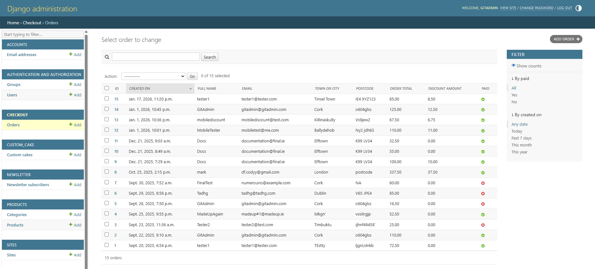
- 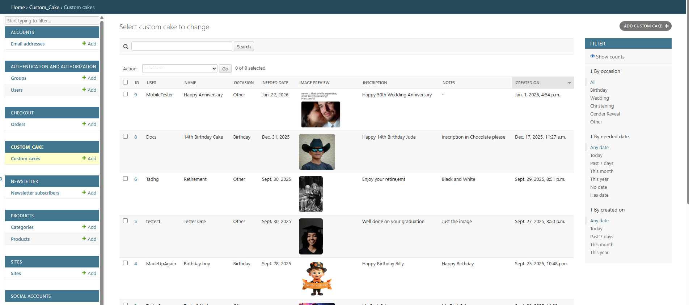
- 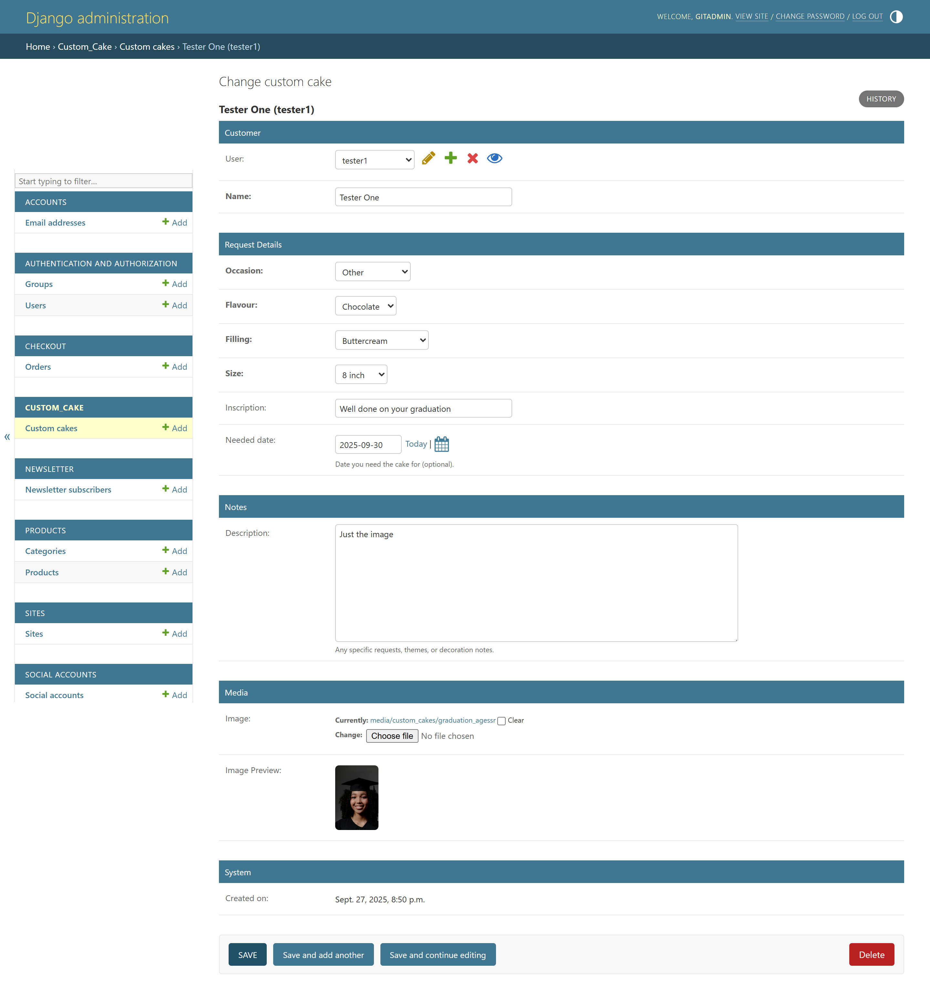

[Back to Top](#top)


### Discount Codes

- `WELCOME10` applies **10% off** the bag subtotal (before delivery).
- The discount is **applied at bag level** and recalculated automatically if items are added or removed.
- The discounted total is **passed through to Stripe**, ensuring customers are charged the correct reduced amount.
- Each discount code can be **used only once per authenticated user**:
  - Once redeemed, the code is recorded against the user’s order.
  - Reuse of the same code by the same user is prevented on subsequent checkouts.
- Completed orders store both `discount_code` and `discount_amount` for admin visibility and auditing.

- Evidence screenshots:
  - 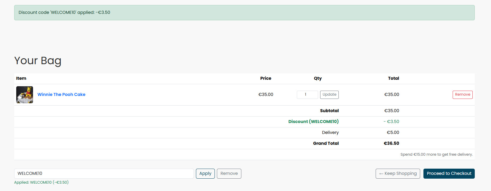
  - 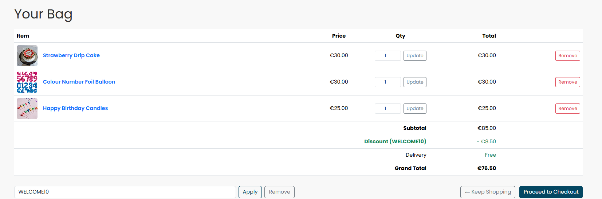
  - 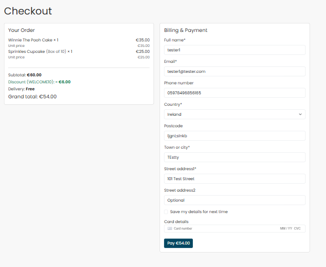
  - 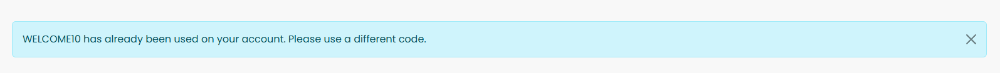
  - 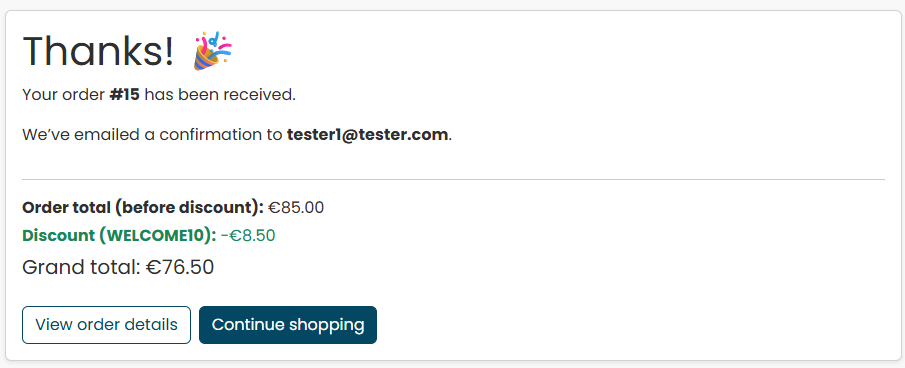

### Newsletter (Marketing)

- Modal popup with email capture.
- Success view shows a welcome code (`WELCOME10`) with copy button.
- Duplicate emails are handled with a friendly message.
- Evidence screenshots:
  - 
  - 
  - 


## H. SEO & Responsiveness

### Search Engine Optimisation (SEO)

Basic SEO best practices have been implemented to improve discoverability and indexing:

- Page `<title>` and `<meta name="description">` tags are defined using Django template blocks and customised per page where appropriate.
- A `robots.txt` file is available at `/robots.txt`, allowing search engines to crawl public pages while restricting access to non-public routes such as admin and account pages.
- A `sitemap.xml` file is available at `/sitemap.xml` and is referenced within `robots.txt`, listing public-facing URLs to assist search engine indexing.
- A custom **404 error page** is implemented to provide a consistent user experience for invalid URLs.
- Semantic HTML and descriptive link text are used throughout the site to support SEO and accessibility.

**Evidence:**

- 
- 
- 
- 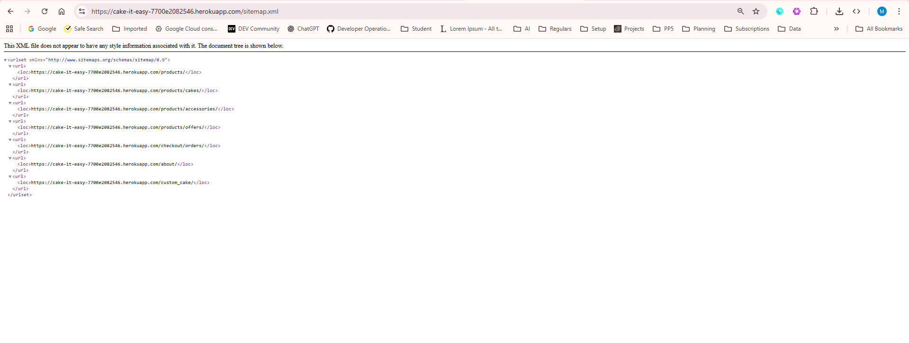


---

### Responsiveness

The application has been designed with a **mobile-first approach** and is fully responsive across common screen sizes:

- Layout adapts smoothly from mobile to tablet and desktop using **Bootstrap 5’s grid system**.
- Navigation collapses into a mobile-friendly menu on smaller screens.
- Product listings, product detail pages, bag, and checkout pages reflow correctly without loss of functionality.
- Touch-friendly controls and readable typography are maintained on mobile devices.

**Evidence:**

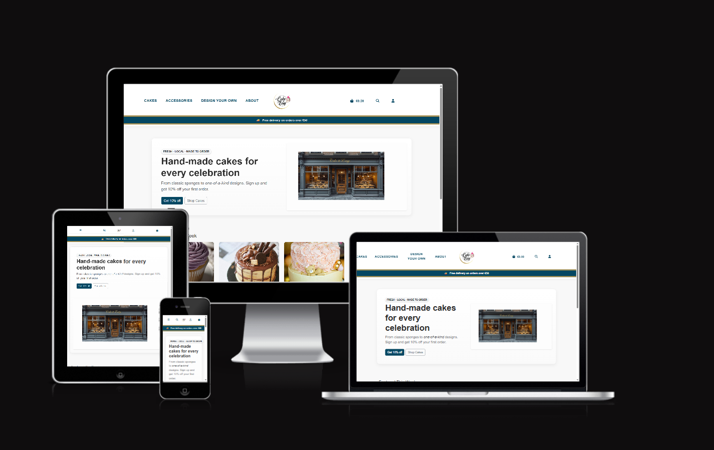


[Back to Top](#top)


---

## Future Features

- Loyalty scheme (points per order)
- Multi‑currency selector
- Product reviews & ratings

[Back to Top](#top)

---

## Testing

All testing steps and expected outcomes are documented in [**TESTING.md**](TESTING.md). Screenshot evidence captured on the **deployed site**.

[Back to Top](#top)

---

### Screenshot Index (placeholders)

## A. Navigation & Layout


## B. Auth


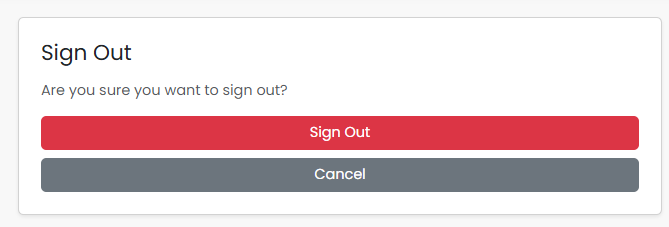


## C. Discovery


## D. Product Detail


## E. Bag


## F. Checkout


## G. Admin


## H. SEO / Responsive


## I. Marketing


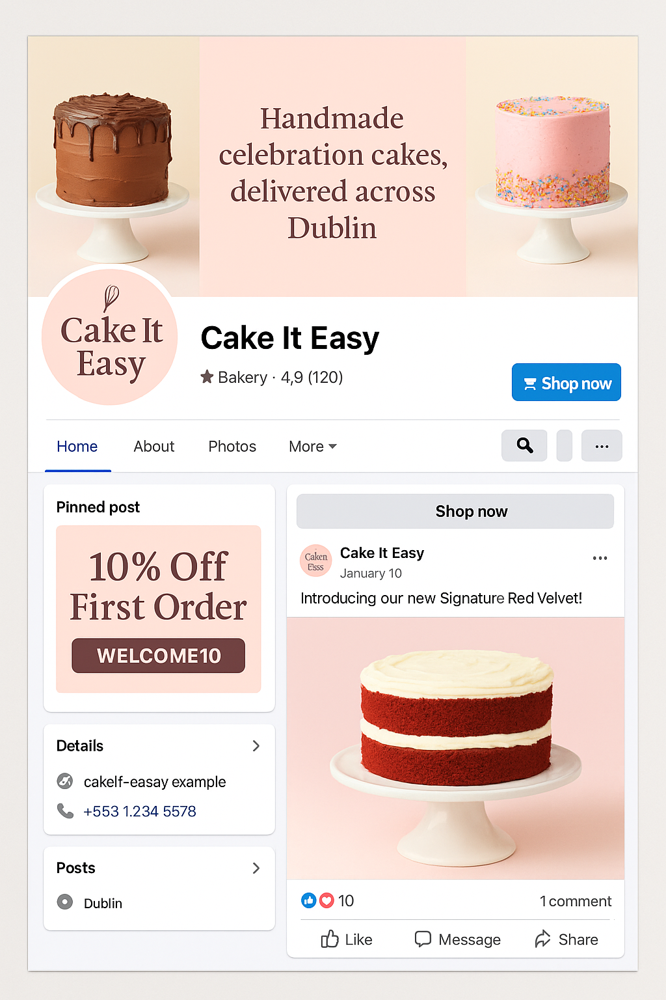

[Back to Top](#top)

---

## Validation

- **HTML:** W3C Validator – key pages validate (see TESTING.md).
- **CSS:** Jigsaw CSS validator – no blocking issues.
- **Python:** PEP8/flake8 – warnings addressed where practical.
- **Lighthouse:** Accessibility & SEO scores captured in TESTING.md.

[Back to Top](#top)

---

## Deployment

This project was deployed using **Heroku** with a PostgreSQL database.

#### Prerequisites
- Python 3.12
- Git
- Heroku account
- Stripe account (test keys)

#### Steps

1. **Clone the repository**
```bash
git clone https://github.com/MaireadKelly/cake_it_easy_v2.git
cd cake_it_easy_v2
```

2. **Create a virtual environment**
```bash
python -m venv .venv
source .venv/bin/activate  # Windows: .venv\Scripts\activate
```

3. **Install Dependencies**
```bash
pip install -r requirements.txt
```

4. **Create an environment file**

Create a `.env` file for **local development only** and add the following variables:  
The following variables are for local development only and should not be committed to the repository!

```ini
SECRET_KEY=dev-secret-change-me
DEBUG=True
STRIPE_PUBLIC_KEY=your_stripe_public_key
STRIPE_SECRET_KEY=your_stripe_secret_key
STRIPE_WH_SECRET=your_webhook_secret
USE_SQLITE=True
```

Note:
The deployed Heroku version uses Heroku Config Vars instead of a .env file.
These values do not need to match — only the variable names must be the same.

5. **Apply Migrations**
```bash
python manage.py migrate
```

6. **Create Superuser**
```bash
python manage.py createsuperuser
```

7. **Run the project Locally**
```bash
python manage.py runserver
```

### Heroku Deployment (Dashboard Method)

This project was deployed using the **Heroku Dashboard** with GitHub integration.

#### Steps

1. Log in to your **Heroku Dashboard**
2. Click **New → Create new app**
3. Enter an app name and select the appropriate region
4. Click **Create app**

---

#### Configure Environment Variables

1. Navigate to **Settings → Reveal Config Vars**
The following environment variables were configured in the Heroku Dashboard under
Settings → Config Vars to support deployment, media storage, payments, and security.

These values are not stored in the repository and must be set manually when deploying.

### Heroku Config Vars

| Key | Description |
|----|------------|
| `ALLOWED_HOSTS` | The deployed Heroku app URL (e.g. `cake-it-easy-7700e2082546.herokuapp.com`) |
| `CSRF_TRUSTED_ORIGINS` | The full Heroku app URL including protocol |
| `DEBUG` | Set to `FALSE` for production |
| `SECRET_KEY` | Django secret key (unique, not committed) |
| `USE_SQLITE` | Set to `FALSE` to use Postgres in production |
| `DATABASE_URL` | Automatically provided by Heroku Postgres |
| `CLOUDINARY_CLOUD_NAME` | Cloudinary cloud name |
| `CLOUDINARY_API_KEY` | Cloudinary API key |
| `CLOUDINARY_API_SECRET` | Cloudinary API secret |
| `CLOUDINARY_URL` | Full Cloudinary connection URL |
| `STRIPE_PUBLIC_KEY` | Stripe publishable key |
| `STRIPE_SECRET_KEY` | Stripe secret key |
| `STRIPE_WH_SECRET` | Stripe webhook signing secret |
| `STRIPE_CURRENCY` | Currency used for payments (e.g. `eur`) |
| `NEWSLETTER_WELCOME_CODE` | Discount code issued on newsletter signup |

Notes on Configuration

- All sensitive values are stored securely using Heroku Config Vars.
- `DATABASE_URL` is automatically set when the Heroku Postgres add-on is installed.
- Stripe keys are set to **test mode** during development and testing.
- Stripe webhooks are configured via the Stripe Dashboard to ensure secure payment confirmation.
- Cloudinary is used for all user-uploaded and product images in production.
- `DEBUG` is disabled in production to prevent exposure of sensitive information.


---

#### Add Database

1. Go to the **Resources** tab
2. Search for **Heroku Postgres**
3. Add the free or essential plan
4. Heroku will automatically populate `DATABASE_URL`

---

#### Connect GitHub Repository

1. Go to the **Deploy** tab
2. Under **Deployment method**, select **GitHub**
3. Search for and connect the `cake_it_easy_v2` repository
4. Choose the `main` branch

---

#### Deploy Application

1. Scroll to **Manual deploy**
2. Click **Deploy Branch**
3. Wait for the build to complete successfully

---

#### Final Setup

1. Open the app via **Open App**
2. Run database migrations via the Heroku console if required
3. Create a superuser for admin access

The application is now live and fully functional.


### Production Configuration Notes (Heroku)

The following configuration ensures the application runs securely and efficiently in production:

- **Procfile**  
  Located at the project root and used by Heroku to start the web server.
  The application is served using Gunicorn:
```env
web: gunicorn cake_it_easy_v2.wsgi:application
```


- **Dependencies**  
All required packages are listed with pinned versions in `requirements.txt`.

- **Debug Mode**  
`DEBUG` is set to `FALSE` in production via Heroku Config Vars to prevent exposure of sensitive information.

- **Database**  
Heroku Postgres is used in production.  
The `DATABASE_URL` environment variable is automatically provided by the Heroku Postgres add-on.

- **Static Files**  
Static assets are served using **Whitenoise**, with `collectstatic` executed automatically during the Heroku build process.

- **Media Files**  
All user-uploaded and product images are stored and served via **Cloudinary**, configured using environment variables.

- **Security**  
Sensitive configuration values (secret keys, API keys, webhook secrets) are managed exclusively via Heroku Config Vars and are not committed to the repository.


[Back to Top](#top)

---

## Custom Cake Orders

- Customers can submit a bespoke cake request via a form capturing **flavour, filling, icing, dietary notes, message**, and optional image.
- Requests are linked to the logged‑in user and visible to staff via admin.
- Evidence screenshots: `docs/readme/custom_cake_form.png`, `docs/readme/custom_cake_list.png`.
- Custom cake orders use a fixed deposit product added to the bag.  
- Multiple custom cake deposits may be added to support multiple bespoke orders in a single session.


[Back to Top](#top)

---

## Known Issues / Fixes

- **Newsletter modal** previously showed code before submit → fixed by unifying modal IDs & JS.
- **Delivery shown on empty bag** → context processor logic fixed.
- **RBAC** for product CRUD → guarded with `@staff_member_required` and template gating.

[Back to Top](#top)

---

## Marketing & SEO Evidence

- **Newsletter:** form/success/duplicate (see screenshots under I.)
- **Facebook:** branded post mockup showing box‑size pricing 

### SEO Evidence – robots.txt & sitemap.xml

A robots.txt file is implemented to guide search engine crawlers.
Admin and authentication routes are excluded from indexing, and a sitemap reference is provided to improve SEO.

Live endpoints:
- https://cake-it-easy-7700e2082546.herokuapp.com/robots.txt
- https://cake-it-easy-7700e2082546.herokuapp.com/sitemap.xml

Evidence screenshots:


[Back to Top](#top)

---

## Business Model & UX Rationale

## Marketing Strategy

Cake It Easy is positioned as a small, local bakery offering handmade cakes, custom designs, and party accessories.  
The marketing strategy focuses on clear navigation, promotional incentives, and repeat customer engagement rather than aggressive upselling.

### Target Audience
- Customers ordering celebration cakes (birthdays, events, special occasions)
- Users seeking custom cake designs
- Customers purchasing party accessories alongside cakes

### Promotional Features
- **Newsletter signup incentive:**  
  Users are offered a welcome discount code when signing up to the newsletter, encouraging first-time purchases.

- **Discount codes:**  
  Promotional discount codes can be applied at checkout to incentivise conversion and increase basket value.

### Product Discovery & Upsell Approach
- **Accessories availability:**  
  Accessories such as candles and balloons are sold via a dedicated *Accessories* category, accessible through prominent navigation.
  This allows customers to easily add complementary products to their order.

- **Clear navigation structure:**  
  Separate categories for Cakes, Accessories, and Custom Cakes help users explore products intuitively and increase engagement.

### Customer Retention
- User accounts allow customers to:
  - View previous orders
  - Save delivery details
  - Experience a faster checkout on repeat visits

This approach balances usability, transparency, and commercial viability while remaining appropriate for a small-scale e-commerce application.


- **Revenue:** core product sales (cakes, cupcakes, and accessories), with promotional discounts used to encourage conversion.

- **Differentiator:** transparent per-cupcake pricing with selectable box sizes, allowing users to understand costs clearly before checkout.

- **UX:** clear navigation, large product imagery, user feedback via toast messages, and a free-delivery banner to support usability and reduce checkout friction.

- **Admin efficiency:** Django admin features and structured product models allow efficient product and price management.

- **Accessories availability:** Accessories such as candles and balloons are offered via a dedicated Accessories category and prominent navigation, allowing customers to add complementary items to their order.


[Back to Top](#top)

---

## Credits

- Code Institute **Boutique Ado** walkthrough.
- Stripe Docs.
- Canva/Unsplash for imagery (placeholders).

## Licence

Educational use for Code Institute Portfolio Project 5.

[Back to Top](#top)
