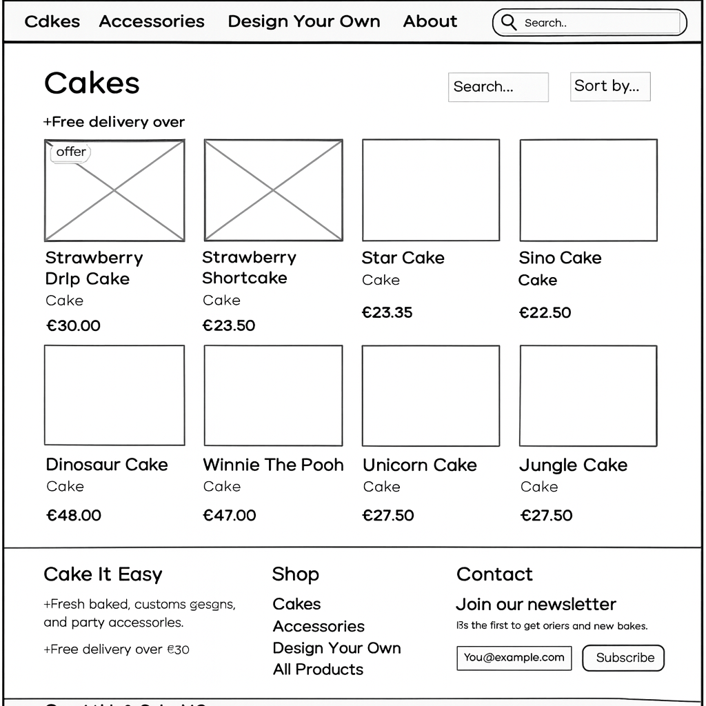
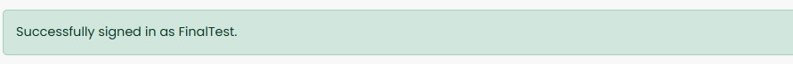
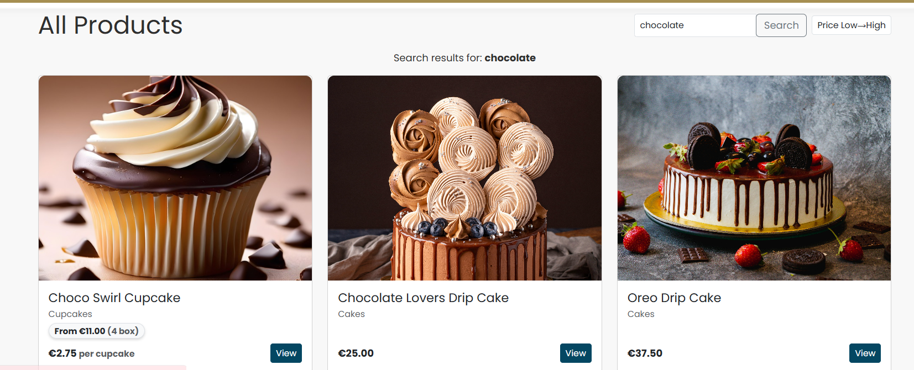

# Cake It Easy v2.0

## 📍 Table of Contents
- [Overview](#overview)
- [Live Project](#live-project)
- [Business Goals](#business-goals)
- [User Goals](#user-goals)
- [Agile Methodology](#agile-methodology)
- [Design](#design)
- [Features](#features)
- [Future Features](#future-features)
- [Testing](#testing)
- [Validation](#validation)
- [Deployment](#deployment)
- [Custom Cake Orders](#custom-cake-orders)
- [Known Issues / Fixes](#known-issues--fixes)
- [Marketing & SEO Evidence](#marketing--seo-evidence)
- [Business Model & UX Rationale](#business-model--ux-rationale)
- [Credits](#credits)
- [Licence](#licence)

---


Cake It Easy v2.0 is a full‑stack e‑commerce site for ordering cakes, cupcakes, and accessories. It builds on the Code Institute **Boutique Ado** walkthrough and adds:

- **Cupcake box‑size pricing** (4/6/12/18) with transparent per‑cupcake price
- **Custom Cake Orders** (bespoke requests)
- **Discount codes** (e.g., `WELCOME10`)
- Evidence screenshots:

  

  

  
- **Newsletter signup** modal with success flow
- **SEO** polish (meta, robots, sitemap, rel)

> This README aligns to the assessor feedback and PP5 criteria. See **TESTING.md** for the step‑by‑step test evidence.

[Back to top](#table-of-contents)
---

## Live Project

- **Live Site:** [https://your-deployed-domain.com](https://cake-it-easy-7700e2082546.herokuapp.com/)
- **Repository:** [https://github.com/MaireadKelly/cake\_it\_easy\_v2](https://github.com/MaireadKelly/cake_it_easy_v2)
- **Project Board (Agile):** [https://github.com/users/MaireadKelly/projects/10](https://github.com/users/MaireadKelly/projects/10)


[Back to top](#table-of-contents)
---

## Business Goals

- Provide a user‑friendly shop for artisan cakes and cupcakes.
- Make pricing clear: **per‑cupcake** and **per‑box**.
- Enable upsell of accessories (candles, balloons).
- Support admin efficiency with inline product options.
- Drive engagement via newsletter and social content.


[Back to top](#table-of-contents)

---


## User Goals

- Browse and search products quickly.
- Understand costs before committing (per cupcake + per box).
- Add/update/remove items easily; see toasts.
- Checkout securely with Stripe.
- Save details and view previous orders.

[Back to top](#table-of-contents)
---

## Agile Methodology

- Managed with a GitHub **Project Board** (link above).
- **Epics**: Products, Bag & Checkout, Profiles, Marketing, SEO/Accessibility, Custom Cakes.
- **MoSCoW**
  - **Must**: Product browsing, Bag, Stripe checkout, RBAC, Cupcake box pricing
  - **Should**: Newsletter modal, SEO (meta/robots/sitemap), responsive layout
  - **Could**: Custom Cake Orders
- Each User Story is tracked as a card with acceptance criteria; closed cards map to commits/deploys.

[Back to top](#table-of-contents)
---

### User Stories (samples)

- As a shopper I can filter cupcakes so I see only relevant items.
- As a shopper I can choose a **box size** so I get the right quantity.
- As a shopper I can see a **per‑cupcake** price so pricing is transparent.
- As a shopper I can **apply a discount code** so I can redeem offers.
- As a staff user I can **add/edit product options** so I can manage packs.
- As a returning user I can **view past orders** so I can reorder.

> Full list and status are available on the project board.

[Back to top](#table-of-contents)
---

## Design

- **Wireframes** (created in Balsamiq, stored in `docs/readme/`):
  
  
  
  
  

- **Typography:** Poppins, Roboto Condensed (Google Fonts).
- **Colour Palette:** Light bakery palette with strong CTA accents (see `static/css/base.css`).
- **Responsiveness:** Bootstrap 5 grid; mobile nav + stacking forms; no horizontal scroll.

### Data Model / ERD


[Back to top](#table-of-contents)

---

## Features

### Products & Discovery

- Product list, detail, search, sort, and category filters (Cakes/Accessories/Cupcakes).
- Cupcake cards display **“From €…”** based on the cheapest configured box.

### Cupcake Box‑Size Pricing

- Product detail shows **€X.XX per cupcake**.
- A **Box size** dropdown (4/6/12/18) appears above Quantity (boxes).
- Pack price auto‑calculates from per‑cupcake × quantity (or uses an override price for bundles).
- Bag line shows **(Box of N)** and **≈ € per cupcake**.

### Shopping Bag

- Add, update, remove with toasts; free‑delivery threshold message.
- **Discount codes** (see below) integrated into totals.

### Checkout (Stripe)

Checkout architecture note: This project is based on Boutique Ado but uses a simplified flow where the Order is created in the checkout view after successful Stripe PaymentIntent confirmation, and the webhook is used to verify the event and mark the order as paid. Discounts are stored separately (discount_amount) and the final total is calculated via a grand_total property for clarity and maintainability.
- Stripe PaymentIntent uses the **discounted** grand total.
- On success, order is created; bag/discount cleared; success page shown.
- Webhooks ready for robust fulfilment (test mode used).

### Profiles

- Saved default delivery details; order history.

### Admin

- Staff‑only product CRUD guarded by `@staff_member_required`.
- Inline **ProductOption** editing for cupcake packs.

### Discount Codes

- `` applies **10% off** the bag subtotal (before delivery).
- Stored in session; **Discount** line appears in Bag and Checkout.
- Stripe charges the **discounted** amount.
- Order records include `discount_code` and `discount_amount`.
- Evidence screenshots:
  - `docs/readme/discount_apply.png`
  - `docs/readme/discount_line_bag.png`
  - `docs/readme/discount_checkout.png`

### Newsletter (Marketing)

- Modal popup with email capture.
- Success view shows a welcome code (`WELCOME10`) with copy button.
- Duplicate emails are handled with a friendly message.
- Evidence screenshots:
  - `docs/readme/newsletter_form.png`
  - `docs/readme/newsletter_success.png`
  - `docs/readme/newsletter_duplicate.png`

### SEO & Accessibility

- `<title>` + `<meta name="description">` per page.
- External links use `rel="noopener noreferrer"`; decorative icons marked `aria-hidden`.
- Custom **404**

- **robots.txt**
 
**sitemap.xml** 


[Back to top](#table-of-contents)

---

## Future Features

- Loyalty scheme (points per order)
- Multi‑currency selector
- Product reviews & ratings

---

## Testing

All testing steps and expected outcomes are documented in [**TESTING.md**](TESTING.md). Screenshot evidence captured on the **deployed site**.

### Screenshot Index

## A. Navigation & Layout


## B. Auth





## C. Discovery




## D. Product Detail


## E. Bag


## F. Checkout


## G. Admin


## H. SEO / Responsive


## I. Marketing


---

## Validation

- **HTML:** W3C Validator – key pages validate (see TESTING.md).
- **CSS:** Jigsaw CSS validator – no blocking issues.
- **Python:** PEP8/flake8 – warnings addressed where practical.
- **Lighthouse:** Accessibility & SEO scores captured in TESTING.md.

---

Deployment
----------

1. **Clone the repository**
```bash
git clone https://github.com/MaireadKelly/cake_it_easy_v2.git
cd cake_it_easy_v2
```

2. **Create and activate a virtual environment**
```bash
python -m venv .venv
source .venv/bin/activate  # Windows: .venv\Scripts\activate
```

3. **Install required packages**
```bash
pip install -r requirements.txt
```

4. **Create environment variables**

Create a `.env` file in the project root:
```text
SECRET_KEY=your-django-secret-key
DEBUG=True
ALLOWED_HOSTS=localhost,127.0.0.1

# Stripe
STRIPE_PUBLIC_KEY=pk_test_xxx
STRIPE_SECRET_KEY=sk_test_xxx
STRIPE_WEBHOOK_SECRET=whsec_xxx

# Cloudinary
CLOUDINARY_URL=cloudinary://<key>:<secret>@<cloud_name>
```

5. **Apply migrations and run the server**
```bash
python manage.py migrate
python manage.py createsuperuser
python manage.py runserver
```

Visit: `http://127.0.0.1:8000`

---

### Heroku Deployment

1. **Create Heroku app**
- Heroku Dashboard → New → Create new app

2. **Add buildpack**
- Settings → Buildpacks → `heroku/python`

3. **Provision database**
- Resources → Add-ons → Heroku Postgres (free tier)

4. **Set Config Vars**
```text
SECRET_KEY=your-django-secret-key
DEBUG=False
ALLOWED_HOSTS=.herokuapp.com
DATABASE_URL=(auto set by Heroku Postgres)

STRIPE_PUBLIC_KEY=pk_live_xxx
STRIPE_SECRET_KEY=sk_live_xxx
STRIPE_WEBHOOK_SECRET=whsec_xxx

CLOUDINARY_URL=cloudinary://<key>:<secret>@<cloud_name>
CLOUDINARY_UPLOAD_PREFIX=cake-it-easy
```

5. **Deploy from GitHub**
- Deploy → GitHub → Connect repository
- Enable automatic deploys
- Deploy branch

6. **Run migrations on Heroku**
```bash
heroku run python manage.py migrate
heroku run python manage.py createsuperuser
```
    
7.  **Configure Stripe Webhook**
    
    *   In Stripe Dashboard → _Developers_ → _Webhooks_ → **Add endpoint**
        
- Endpoint URL: `https://<your-app>.herokuapp.com/checkout/wh/`
- Events: `payment_intent.succeeded`, `payment_intent.payment_failed`
        
    *   Copy the **Signing secret** and set it as STRIPE\_WH\_SECRET in Heroku Config Vars.
        
8.  **Verify production**
    
    *   Visit https://.herokuapp.com
        
    *   Make a test purchase (use Stripe test card if in test mode)
        
    *   Confirm order confirmation page, email output (if configured), and webhook receipt in Stripe Dashboard.
        

### 3) Production Parity & Security

*   The **live app mirrors the development branch**; feature parity is maintained.
    
*   **DEBUG=False** on Heroku; all secrets stored in **Config Vars** (not committed).
    
*   **Static files** are collected via collectstatic and served by Django on Heroku; **media files** are stored on **Cloudinary**.
    
*   **Database**: Heroku Postgres in production; SQLite allowed locally for simplicity.
    
*   Code validated before deploy; core flows retested (browse → add to cart → checkout → webhook → confirmation).
    

### 4) Troubleshooting

*   **Static files not loading**: ensure collectstatic completed and no DISABLE\_COLLECTSTATIC remains set.
    
*   **Webhook errors**: confirm the exact endpoint path, the live site URL, and that STRIPE\_WH\_SECRET matches the secret shown for this endpoint in Stripe.
    
*   **403/CSRF issues in admin**: confirm ALLOWED\_HOSTS includes your Heroku domain.
    
*   **DB errors**: re-run migrate on Heroku, confirm DATABASE\_URL exists (it’s set by the Postgres add-on).
    

### 5) One-Command Local Reset (optional)

Plain textANTLR4BashCC#CSSCoffeeScriptCMakeDartDjangoDockerEJSErlangGitGoGraphQLGroovyHTMLJavaJavaScriptJSONJSXKotlinLaTeXLessLuaMakefileMarkdownMATLABMarkupObjective-CPerlPHPPowerShell.propertiesProtocol BuffersPythonRRubySass (Sass)Sass (Scss)SchemeSQLShellSwiftSVGTSXTypeScriptWebAssemblyYAMLXML`   # Danger: wipes local DB  rm -f db.sqlite3  find . -path "*/migrations/*.py" -not -name "__init__.py" -delete  python manage.py makemigrations  python manage.py migrate  python manage.py createsuperuser   `

This deployment guide has been tested end-to-end and contains all setup details (files, packages, resources, environment variables, and commands) required to **clone, run, and deploy** the project without external documentation.
---

## Custom Cake Orders

- Customers can submit a bespoke cake request via a form capturing **flavour, filling, icing, dietary notes, message**, and optional image.
- Requests are linked to the logged‑in user and visible to staff via admin.
- Evidence screenshots: 
 

---

## Known Issues / Fixes

- **Newsletter modal** previously showed code before submit → fixed by unifying modal IDs & JS.
- **Delivery shown on empty bag** → context processor logic fixed.
- **RBAC** for product CRUD → guarded with `@staff_member_required` and template gating.

---

## Marketing & SEO Evidence

- **Newsletter:** form/success/duplicate (see screenshots under I.)
- **Facebook:** branded post mockup
-### SEO Evidence – robots.txt & sitemap.xml

Live endpoints:
- https://cake-it-easy-7700e2082546.herokuapp.com/robots.txt
- https://cake-it-easy-7700e2082546.herokuapp.com/sitemap.xml

Evidence screenshots:


---

## Business Model & UX Rationale

- **Revenue:** core product sales (cakes/cupcakes), accessories upsell, occasional bundles.
- **Differentiator:** transparent per‑cupcake price + selectable box sizes.
- **UX:** simple filters, big images, toasts, free‑delivery banner; checkout friction minimized.
- **Admin efficiency:** inline product options make updates fast.

---

## Credits

- Code Institute **Boutique Ado** walkthrough.
- Stripe Docs.
- Canva/Unsplash for imagery (placeholders).

## Licence

Educational use for Code Institute Portfolio Project 5.

