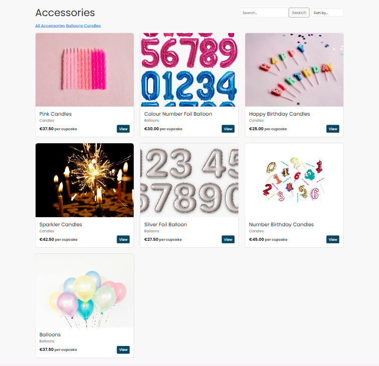
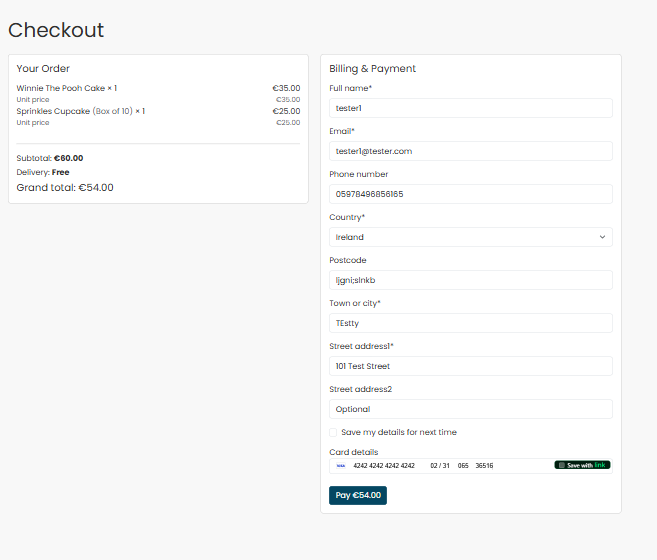

# Cake It Easy v2.0

<a id="top"></a>

## Table of Contents
- [Live Project](#live-project)
- [Business Goals](#business-goals)
- [User Goals](#user-goals)
- [Agile Methodology](#agile-methodology)
- [Design](#design)
- [Data Model / ERD](#data-model--erd)
- [Features](#features)
- [Testing](#testing)
- [Validation](#validation)
- [Deployment](#deployment)
- [Marketing & SEO Evidence](#marketing--seo-evidence)
- [Business Model & UX Rationale](#business-model--ux-rationale)
- [Credits](#credits)
- [Licence](#licence)


Cake It Easy v2.0 is a full-stack Django e-commerce application that allows customers to easily browse, customise, and order cakes and cupcakes online.

The site is designed to provide a smooth, user-focused shopping experience — from discovering products and selecting box sizes, to applying discount codes and completing secure checkout. It is built using the Code Institute Boutique Ado walkthrough as a foundation, with significant customisation and additional features introduced to meet the project’s functional, UX, and assessment requirements.

Key features include cupcake box-size pricing with clear per-item costs, bespoke custom cake order requests, promotional discount codes, and a newsletter signup flow. The project also incorporates SEO best practices, user authentication, and full CRUD functionality where appropriate.

> This README documents the application structure, features, and development decisions in line with the PP5 assessment criteria. Full manual testing steps and evidence are provided in [**TESTING.md**](TESTING.md) for the step‑by‑step test evidence.

[Back to Top](#top)

---

## Live Project

- **Live Site:** [https://cake-it-easy-7700e2082546.herokuapp.com/](https://cake-it-easy-7700e2082546.herokuapp.com/)
- **Repository:** [https://github.com/MaireadKelly/cake\_it\_easy\_v2](https://github.com/MaireadKelly/cake_it_easy_v2)
- **Project Board (Agile):** [https://github.com/users/MaireadKelly/projects/10](https://github.com/users/MaireadKelly/projects/10)

[Back to Top](#top)


---

## Business Goals

- Provide a user‑friendly shop for artisan cakes and cupcakes.
- Make pricing clear: **per‑cupcake** and **per‑box**.
- Enable upsell of accessories (candles, balloons).
- Support admin efficiency with inline product options.
- Drive engagement via newsletter and social content.

[Back to Top](#top)

---

## User Goals

- Browse and search products quickly.
- Understand costs before committing (per cupcake + per box).
- Add/update/remove items easily; see toasts.
- Checkout securely with Stripe.
- Save details and view previous orders.

[Back to Top](#top)

---

## Agile Methodology

- Managed with a GitHub **Project Board** (link above).
- **Epics**: Products, Bag & Checkout, Profiles, Marketing, SEO/Accessibility, Custom Cakes.
- **MoSCoW**
  - **Must**: Product browsing, Bag, Stripe checkout, RBAC, Cupcake box pricing
  - **Should**: Newsletter modal, SEO (meta/robots/sitemap), responsive layout
  - **Could**: Custom Cake Orders
- Each User Story is tracked as a card with acceptance criteria; closed cards map to commits/deploys.

### User Stories (samples)

- As a shopper I can **filter and search** so I see only relevant items.
- As a shopper I can choose a **box size** so I get the right quantity.
- As a shopper I can see a **per‑cupcake** price so pricing is transparent.
- As a shopper I can **apply a discount code** so I can redeem offers.
- As a staff user I can **add/edit product options** so I can manage packs.
- As a returning user I can **view past orders** so I can reorder.

> Full list and status are available on the project board.

[Back to Top](#top)

---

## Design

- **Wireframes** (created in Balsamiq, stored in `docs/readme/`):
  
  
  
  
  

- **Typography:** Poppins, Roboto Condensed (Google Fonts).
- **Colour Palette:** Light bakery palette with strong CTA accents (see [static/css/base.css](static/css/base.css))
.
- **Responsiveness:** Bootstrap 5 grid; mobile nav + stacking forms; bag table supports horizontal scroll on small screens to preserve pricing columns.

### Data Model / ERD


[Back to Top](#top)

---

## Features

### Products & Discovery
- Home Page
  - 

- Product list, detail, search, sort, and category filters (Cakes/Accessories/Cupcakes).
  - 
  - 
  - 
  - 
  - 

### Cupcake Box-Size Pricing
- Product detail shows **€X.XX per cupcake**.
  - 

- A **Box size** dropdown (4/6/10/12) appears above Quantity (boxes).
  - 

- Pack price auto-calculates from per-cupcake × quantity (or uses an override price for bundles).
- Bag line shows **(Box of N)** and **≈ € per cupcake**.
- Cupcake cards display **“From €…”** based on the cheapest configured box.
  - 

### Authentication
- Users can register, log in, and log out securely.
- Auth flows use Django’s built-in authentication with CSRF protection and server-side validation.
- Feedback is provided via Bootstrap alerts (messages framework).

**Evidence:**
- 
- 
- 
- 
- 

### Custom Cake Orders
- Customers can submit a bespoke cake request via a form capturing **flavour, filling, icing, dietary notes, message**, and optional image.
- Requests are linked to the logged-in user and visible to staff via admin.
  - 

- Custom cake orders use a fixed deposit product added to the bag.
  - 

- Multiple custom cake deposits may be added to support multiple bespoke orders in a single session.

### Shopping Bag
- Add, update, remove with toasts; free-delivery threshold message.
  - 
  - 
  - 
  - 

- **Discount codes** (see below) integrated into totals.
  - 

- On smaller screens, the bag uses a horizontally scrollable table to ensure pricing information remains accessible.
  - 
  - 
  - 

### Checkout (Stripe)
- Stripe PaymentIntent uses the **discounted** grand total.
- On success, order is created; bag/discount cleared; success page shown.
  - 

- Webhooks ready for robust fulfilment (test mode used).
  - 
  - 

### Profiles
- Saved default delivery details; order history and detailed order view.
  - 
  - 

> Note: Completed orders show any applied discount code and discount amount to provide pricing transparency.

### Admin
Administration is handled through the Django Admin panel. Access is restricted to staff/superusers.
- When logged in as an Admin Shortcut to Django Admin Panel Shortcut 


**Security / access control:**
- Admin access requires staff permissions.
- Sensitive settings (secret keys, API keys, webhook secrets) are not stored in the repo and are managed via environment variables / Heroku Config Vars.

**Product management:**
- Staff can add/edit/delete products and maintain catalogue content.
- Inline **ProductOption** editing supports cupcake pack sizes and pricing.


**Order management:**
- Orders are visible to staff for fulfilment.
- Order line items are shown inline on each order.
  - 

- Staff can mark an order as **Paid/Unpaid** using the `paid` checkbox.
  - 
  - 

- Staff can bulk-update multiple orders using **“Mark selected orders as paid”**.
  - 

**Custom Cake Requests (admin):**
- Requests are visible for review and follow-up.
- The **description/notes** field is displayed for staff.
- A small **image preview** is shown when an image is attached.
  - 
  - 

### Discount Codes
- `WELCOME10` applies **10% off** the bag subtotal (before delivery).
- The discount is applied at bag level and recalculated automatically if items are added or removed.
- The discounted total is passed through to Stripe, ensuring customers are charged the reduced amount.
- Each discount code can be used only once per authenticated user:
  - Once redeemed, the code is recorded against the user’s order.
  - Reuse of the same code by the same user is prevented on subsequent checkouts.
  - 

- Completed orders store both `discount_code` and `discount_amount` for admin visibility and auditing.
  - 
  - 
  - 

### Newsletter (Marketing)
- Modal popup with email capture.
- Success view shows a welcome code (`WELCOME10`) with copy button.
- Duplicate emails are handled with a friendly message.

**Evidence:**
- 
- 
- 

[Back to Top](#top)

---

## Future Features

- Loyalty scheme (points per order)
- Multi‑currency selector
- Product reviews & ratings

[Back to Top](#top)

---

## Testing

All testing steps and expected outcomes are documented in [**TESTING.md**](TESTING.md). Screenshot evidence captured on the **deployed site**.

[Back to Top](#top)

---

## Validation

- **HTML:** W3C Validator – key pages validate (see TESTING.md).
- **CSS:** Jigsaw CSS validator – no blocking issues.
- **Python:** PEP8/flake8 – warnings addressed where practical.
- **Lighthouse:** Accessibility & SEO scores captured in TESTING.md.

[Back to Top](#top)

---

## Deployment

This project was deployed using **Heroku** with a PostgreSQL database.

#### Prerequisites
- Python 3.12
- Git
- Heroku account
- Stripe account (test keys)

## Local Setup

#### Steps

1. **Clone the repository**
```bash
git clone https://github.com/MaireadKelly/cake_it_easy_v2.git
cd cake_it_easy_v2
```

2. **Create a virtual environment**
```bash
python -m venv .venv
source .venv/bin/activate  # Windows: .venv\Scripts\activate
```

3. **Install Dependencies**
```bash
pip install -r requirements.txt
```

4. **Create an environment file**

Create a `.env` file on the root directory for **local development only** and add the following variables:  
The following variables are for local development only and should not be committed to the repository!

```ini
# Local development only (DO NOT commit this file)

DEBUG=True
SECRET_KEY=dev-secret-change-me

# Local hosts (only required if your settings reference these env vars)
ALLOWED_HOSTS=localhost,127.0.0.1
CSRF_TRUSTED_ORIGINS=http://localhost,http://127.0.0.1

# Database selection
# Use SQLite locally for simplest setup:
USE_SQLITE=True
# If using Postgres locally, set USE_SQLITE=False and provide DATABASE_URL instead.
# DATABASE_URL=your_database_url

# Cloudinary (only required if you are uploading/serving media via Cloudinary locally)
CLOUDINARY_CLOUD_NAME=your_cloudinary_cloud_name
CLOUDINARY_API_KEY=your_cloudinary_api_key
CLOUDINARY_API_SECRET=your_cloudinary_api_secret

# Stripe (required for checkout)
STRIPE_PUBLIC_KEY=your_stripe_public_key
STRIPE_SECRET_KEY=your_stripe_secret_key
STRIPE_WEBHOOK_SECRET=your_stripe_webhook_secret
STRIPE_CURRENCY=eur

# Newsletter welcome discount code
NEWSLETTER_WELCOME_CODE=WELCOME10


```

Note:  
The deployed Heroku version uses Config Vars instead of a `.env` file.
Additional variables for Postgres, Cloudinary, allowed hosts, and security
are configured in production and are not required for local development.


5. **Apply Migrations**
```bash
python manage.py migrate
```

6. **Create Superuser**
```bash
python manage.py createsuperuser
```

7. **Run the project Locally**
```bash
python manage.py runserver
```

### Heroku Deployment (Dashboard Method)

This project was deployed using the **Heroku Dashboard** with GitHub integration.

#### Steps

1. Log in to your **Heroku Dashboard**
2. Click **New → Create new app**
3. Enter an app name and select the appropriate region
4. Click **Create app**

---

#### Configure Environment Variables

1. Navigate to **Settings → Reveal Config Vars**
The following environment variables were configured in the Heroku Dashboard under
Settings → Config Vars to support deployment, media storage, payments, and security.

These values are not stored in the repository and must be set manually when deploying.

### Heroku Config Vars

| Key | Description |
|----|------------|
| `ALLOWED_HOSTS` | The deployed Heroku app URL (e.g. `cake-it-easy-7700e2082546.herokuapp.com`) |
| `CSRF_TRUSTED_ORIGINS` | The full Heroku app URL including protocol |
| `DEBUG` | Set to `FALSE` for production |
| `SECRET_KEY` | Django secret key (unique, not committed) |
| `USE_SQLITE` | Set to `FALSE` to use Postgres in production |
| `DATABASE_URL` | Automatically provided by Heroku Postgres |
| `CLOUDINARY_CLOUD_NAME` | Cloudinary cloud name |
| `CLOUDINARY_API_KEY` | Cloudinary API key |
| `CLOUDINARY_API_SECRET` | Cloudinary API secret |
| `CLOUDINARY_URL` | Full Cloudinary connection URL |
| `STRIPE_PUBLIC_KEY` | Stripe publishable key |
| `STRIPE_SECRET_KEY` | Stripe secret key |
| `STRIPE_WEBHOOK_SECRET` | Stripe webhook signing secret |
| `STRIPE_CURRENCY` | Currency used for payments (e.g. `eur`) |
| `NEWSLETTER_WELCOME_CODE` | Discount code issued on newsletter signup |

Notes on Configuration

- All sensitive values are stored securely using Heroku Config Vars.
- `DATABASE_URL` is automatically set when the Heroku Postgres add-on is installed.
- Stripe keys are set to **test mode** during development and testing.
- Stripe webhooks are configured via the Stripe Dashboard to ensure secure payment confirmation.
- Cloudinary is used for all user-uploaded and product images in production.
- `DEBUG` is disabled in production to prevent exposure of sensitive information.


---

#### Add Database

1. Go to the **Resources** tab
2. Search for **Heroku Postgres**
3. Add the free or essential plan
4. Heroku will automatically populate `DATABASE_URL`

---

#### Connect GitHub Repository

1. Go to the **Deploy** tab
2. Under **Deployment method**, select **GitHub**
3. Search for and connect the `cake_it_easy_v2` repository
4. Choose the `main` branch

---

#### Deploy Application

1. Scroll to **Manual deploy**
2. Click **Deploy Branch**
3. Wait for the build to complete successfully

---

#### Final Setup

1. Open the app via **Open App**
2. Run database migrations via the Heroku console if required
3. Create a superuser for admin access

The application is now live and fully functional.


### Production Configuration Notes (Heroku)

The following configuration ensures the application runs securely and efficiently in production:

- **Procfile**  
  Located at the project root and used by Heroku to start the web server.
  The application is served using Gunicorn:
```
web: gunicorn cake_it_easy_v2.wsgi:application --log-file -
```


- **Dependencies**  
All required packages are listed with pinned versions in `requirements.txt`.

- **Debug Mode**  
`DEBUG` is set to `FALSE` in production via Heroku Config Vars to prevent exposure of sensitive information.

- **Database**  
Heroku Postgres is used in production.  
The `DATABASE_URL` environment variable is automatically provided by the Heroku Postgres add-on.

- **Static Files**  
Static assets are served using **Whitenoise**, with `collectstatic` executed automatically during the Heroku build process.

- **Media Files**  
All user-uploaded and product images are stored and served via **Cloudinary**, configured using environment variables.

- **Security**  
Sensitive configuration values (secret keys, API keys, webhook secrets) are managed exclusively via Heroku Config Vars and are not committed to the repository.


[Back to Top](#top)

---

## Known Issues / Fixes

- **Newsletter modal** previously showed code before submit → fixed by unifying modal IDs & JS.
- **Delivery shown on empty bag** → context processor logic fixed.
- **RBAC** for product CRUD → guarded with `@staff_member_required` and template gating.

[Back to Top](#top)

---

## SEO & Responsiveness

### Search Engine Optimisation (SEO)

Basic SEO best practices have been implemented to improve discoverability, accessibility, and indexing of the application:

- Page `<title>` and `<meta name="description">` tags are defined using Django template blocks and customised per page where appropriate.
- Semantic HTML elements and descriptive link text are used throughout the site to support accessibility and SEO.
- A custom **404 error page** is implemented to provide a consistent user experience for invalid URLs.
- A `robots.txt` file is available to guide search engine crawlers.
- A `sitemap.xml` file is provided to assist with indexing of public-facing pages.

**Live endpoints:**
- https://cake-it-easy-7700e2082546.herokuapp.com/robots.txt
- https://cake-it-easy-7700e2082546.herokuapp.com/sitemap.xml

**Evidence:**
- 
- 
- 
- 

---

### Responsiveness

The application follows a **mobile-first design approach** and is responsive across common screen sizes:

- Layout adapts from mobile to tablet and desktop using **Bootstrap 5’s grid system**.
- Navigation collapses into a mobile-friendly menu on smaller screens.
- Product listings, product detail pages, shopping bag, and checkout remain fully functional on mobile devices.
- On smaller screens, horizontally scrollable tables are used where necessary (e.g. the shopping bag) to ensure all pricing information remains accessible without overcrowding the layout.

**Evidence:**
- 
- 
- 

[Back to Top](#top)


---

## Business Model & UX Rationale

## Marketing Strategy

Cake It Easy is positioned as a small, local bakery offering handmade cakes, custom designs, and party accessories.  
The marketing strategy focuses on clear navigation, promotional incentives, and repeat customer engagement rather than aggressive upselling.

### Target Audience
- Customers ordering celebration cakes (birthdays, events, special occasions)
- Users seeking custom cake designs
- Customers purchasing party accessories alongside cakes

### Promotional Features
- **Newsletter signup incentive:**  
  Users are offered a welcome discount code when signing up to the newsletter, encouraging first-time purchases.

- **Discount codes:**  
  Promotional discount codes can be applied at checkout to incentivise conversion and increase basket value.

### Product Discovery & Upsell Approach
- **Accessories availability:**  
  Accessories such as candles and balloons are sold via a dedicated *Accessories* category, accessible through prominent navigation.
  This allows customers to easily add complementary products to their order.

- **Clear navigation structure:**  
  Separate categories for Cakes, Accessories, and Custom Cakes help users explore products intuitively and increase engagement.

### Customer Retention
- User accounts allow customers to:
  - View previous orders
  - Save delivery details
  - Experience a faster checkout on repeat visits

This approach balances usability, transparency, and commercial viability while remaining appropriate for a small-scale e-commerce application.


- **Revenue:** core product sales (cakes, cupcakes, and accessories), with promotional discounts used to encourage conversion.

- **Differentiator:** transparent per-cupcake pricing with selectable box sizes, allowing users to understand costs clearly before checkout.

- **UX:** clear navigation, large product imagery, user feedback via toast messages, and a free-delivery banner to support usability and reduce checkout friction.

- **Admin efficiency:** Django admin features and structured product models allow efficient product and price management.

- **Accessories availability:** Accessories such as candles and balloons are offered via a dedicated Accessories category and prominent navigation, allowing customers to add complementary items to their order.


- **Facebook:** branded post mockup
[Back to Top](#top)

---

## Credits

- Code Institute **Boutique Ado** walkthrough.
- Stripe Docs.
- Canva/Unsplash for imagery (placeholders).

## Licence

Educational use for Code Institute Portfolio Project 5.

[Back to Top](#top)
