# TESTING.md

## Table of Contents

- [Overview](#overview)
- [Automated Tests](#automated-tests)
- [Manual Test Matrix](#manual-test-matrix)
  - [Manual Test 1: Products List](#manual-test-1-products-list)
  - [Manual Test 2: Product Detail](#manual-test-2-product-detail)
  - [Manual Test 3: Shopping Bag](#manual-test-3-shopping-bag)
  - [Manual Test 4: Checkout & Payment](#manual-test-4-checkout--payment)
  - [Manual Test 5: Authentication & Profiles](#manual-test-5-authentication--profiles)
- [Validation](#validation)
  - [Python (PEP8 / pycodestyle)](#python-pep8--pycodestyle--79-cols)
  - [HTML (W3C Validator)](#html-w3c-validator)
  - [CSS (Jigsaw Validator)](#css-jigsaw-validator)
- [Lighthouse Audits](#lighthouse-performance--accessibility--best-practices--seo)
- [Browser & Device Coverage](#browser--device-coverage)
- [Known Issues / Out-of-Scope](#known-issues--out-of-scope)
- [Evidence Index](#evidence-index-examples)


## Overview
This project uses **automated tests**, a concise **manual test matrix**, and **validator evidence**.  
All screenshots are stored in:

- Python (PEP8/pycodestyle): `docs/testing/py/`
- HTML (W3C): `docs/testing/html/`
- CSS (Jigsaw): `docs/testing/css/`
- JavaScript (ESLint): `docs/testing/js/`

For feature descriptions and screenshots, see:
- [README Features section](README.md#features)
- [README SEO evidence](README.md#seo--responsiveness)

### Quick Evidence Links
- [Assessor-critical evidence (screenshots)](TESTING.md#evidence-index-assessor-critical)
- [Manual Test Matrix](TESTING.md#manual-test-matrix)
- [Validation evidence](TESTING.md#validation)


**Naming convention:** screenshots are saved as `val_<path-with-slashes-replaced-by-underscores>.png`.  
Example: `products/views.py` → `docs/testing/py/val_products_views.png`.

---

## Automated Tests

Automated tests were reused from the previous iteration of the project and re-run for this submission to ensure continued correctness after feature and documentation updates.

### Test Coverage

- **Shopping Bag**
  - `bag/tests/test_views.py`
  - Verifies bag page rendering and add / adjust / remove item behaviour.

- **Role-Based Access Control (RBAC)**
  - `products/tests/test_rbac.py`
  - Confirms non-staff users are blocked from product CRUD routes.

- **Custom Cake Requests**
  - `custom_cake/tests.py`
  - Covers create, update, delete flows, validation feedback, and data persistence.

### Test Execution Evidence

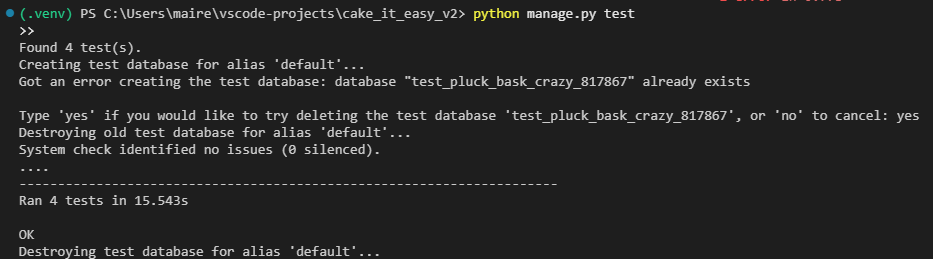

---

## Manual Test Matrix
### Manual Test 1: Products List

| Area | Scenario | Steps | Expected | Result |
|------|---------|-------|----------|--------|
| Products List | View all products | Navigate to Shop / Products page | Products display in a grid with image, name, price, and category | Pass |
| Category Filter | Filter by Accessories | Click Accessories category | Only accessory products are shown | Pass |
| Category Filter | Filter by Cupcakes | Click Cupcakes category | Only cupcake products are shown with correct pricing indicators | Pass |
| Search | Search for product | Enter keyword in search bar and submit | Matching products are displayed | Pass |
| Sorting | Sort by price (low → high) | Select “Price (Low to High)” from sort dropdown | Products reorder correctly by ascending price | Pass |
| Sorting & Filtering | Sort within category view | Navigate to a category and apply sort option | Products remain scoped to category and sort correctly | Pass |


### Manual Test 2: Product Detail
| Area           | Scenario                                  | Steps                                            | Expected                                                   | Result |
| -------------- | ----------------------------------------- | ------------------------------------------------ | ---------------------------------------------------------- | ------ |
| Product Detail | Load product detail page                  | Navigate to a product from the product listing   | Product detail page loads without errors                   | Pass   |
| Product Detail | Product information display               | View product name, image, description, and price | All product details are displayed clearly                  | Pass   |
| Product Detail | Cupcake box-size selector (cupcakes only) | Open a cupcake product detail page               | Box-size dropdown is visible above quantity selector       | Pass   |
| Product Detail | Dynamic price calculation                 | Change cupcake box size                          | Price updates dynamically based on selected box size       | Pass   |
| Product Detail | Quantity selector                         | Increase/decrease quantity                       | Quantity updates correctly without page reload             | Pass   |
| Product Detail | Add to bag (standard product)             | Click **Add to Bag**                             | Product is added to the bag and confirmation message shown | Pass   |
| Product Detail | Add to bag (cupcake with option)          | Select box size and add to bag                   | Correct box size and calculated price appear in bag        | Pass   |
| Product Detail | Custom cake CTA                           | Navigate to **Design Your Own** custom cake page | Custom cake form loads successfully                        | Pass   |
| Product Detail | Accessibility check                       | Navigate using keyboard                          | All interactive elements are reachable and usable          | Pass   |

 ### Manual Test 3: Shopping Bag
  
| Area         | Scenario                   | Steps                                                     | Expected                                       | Result |
| ------------ | -------------------------- | --------------------------------------------------------- | ---------------------------------------------- | ------ |
| Shopping Bag | View bag page              | Add an item and navigate to the bag                       | Bag page loads with added items displayed      | Pass   |
| Shopping Bag | Bag line item display      | View product name, image, price, quantity, and line total | All details display correctly                  | Pass   |
| Shopping Bag | Update quantity            | Increase or decrease quantity and click update            | Line total and bag totals update correctly     | Pass   |
| Shopping Bag | Remove item                | Click remove item button                                  | Item is removed and totals recalculate         | Pass   |
| Shopping Bag | Free delivery threshold    | Add items below and above threshold                       | Free delivery message updates correctly        | Pass   |
| Shopping Bag | Discount code apply        | Enter valid discount code and apply                       | Discount is applied and shown in totals        | Pass   |
| Shopping Bag | Discount code invalid      | Enter invalid or empty discount code                      | Error message displayed, no discount applied   | Pass   |
| Shopping Bag | Discount reuse prevention  | Attempt to reuse `WELCOME10` after previous order         | Discount is rejected with informative message  | Pass   |
| Shopping Bag | Discount revalidation after login | 1. Complete paid order with WELCOME10.<br>2. Logout.<br>3. As guest, add item + apply WELCOME10.<br>4. Login and visit bag. | Discount is automatically removed and warning message displayed before checkout access. | Pass |
| Shopping Bag | Discount removal           | Remove applied discount                                   | Discount line removed and totals restored      | Pass   |
| Shopping Bag | Mobile responsiveness      | View bag on mobile screen size                            | All content accessible without layout breakage. On smaller screens, the bag uses horizontal scrolling to preserve full pricing visibility without compressing content. | Pass   |
| Shopping Bag | Horizontal scroll (mobile) | Scroll bag table horizontally on mobile                   | All pricing columns remain accessible          | Pass   |
| Shopping Bag | Accessibility              | Navigate bag using keyboard                               | Controls reachable and usable                  | Pass   |

### Manual Test 4: Checkout & Payment
| Area     | Scenario                    | Steps                                             | Expected                                          | Result |
| -------- | --------------------------- | ------------------------------------------------- | ------------------------------------------------- | ------ |
| Checkout | Access checkout page        | Add item to bag and click **Checkout**            | Checkout page loads with order summary            | Pass   |
| Checkout | Required field validation   | Submit checkout form with required fields missing | Validation messages displayed, form not submitted | Pass   |
| Checkout | Country selection           | Attempt checkout without selecting country        | User prompted to select country                   | Pass   |
| Checkout | Order summary accuracy      | Review items, quantities, and totals on checkout  | Summary matches bag contents                      | Pass   |
| Checkout | Discount persistence        | Apply discount in bag, proceed to checkout        | Discount remains applied in checkout totals       | Pass   |
| Checkout | Stripe card form            | Enter valid Stripe test card details              | Card form accepts input                           | Pass   |
| Checkout | Successful payment          | Complete checkout using test card                 | Payment succeeds, order created                   | Pass   |
| Checkout | Stripe amount               | Complete checkout with discount applied           | Stripe charge reflects discounted total           | Pass   |
| Checkout | PaymentIntent duplication   | Refresh or resubmit checkout                      | Only one payment is created                       | Pass   |
| Checkout | Checkout success page       | Complete successful payment                       | Success page displayed with order confirmation    | Pass   |
| Checkout | Bag cleared                 | Complete checkout                                 | Bag is emptied after order completion             | Pass   |
| Checkout | Order saved                 | View order via profile                            | Order appears in order history                    | Pass   |
| Checkout | Order discount record       | View completed order                              | Discount code and amount stored on order          | Pass   |
| Checkout | Stripe webhooks (test mode) | Complete payment                                  | Webhook received and order marked paid            | Pass   |
| Checkout | Accessibility               | Navigate checkout via keyboard                    | All form fields accessible                        | Pass   |
| Checkout | Mobile checkout             | Complete checkout on mobile viewport              | Checkout usable and readable                      | Pass   |
| Card Number           | Result             |
| ----------------------------- | ------------------ |
| `4242 4242 4242 4242` | Successful payment |
| `4000 0000 0000 0002` | Declined payment   |


### Manual Test 5: Authentication & Profiles
| Area | Scenario | Steps | Expected | Result |
|---|---|---|---|---|
| Auth | Register new user | Go to Register → enter valid details → submit | Account created; success message shown | Pass |
| Auth | Register validation | Submit empty or invalid form | Validation errors displayed | Pass |
| Auth | Login success | Enter valid credentials | User logged in; redirected; success message | Pass |
| Auth | Login failure | Enter invalid credentials | Login blocked; error message shown | Pass |
| Auth | Logout | Click logout | User logged out; confirmation message shown | Pass |
| Profiles | Access profile (logged in) | Login → open Profile | Profile page loads | Pass |
| Profiles | Access profile (logged out) | Logout → visit profile URL | Redirected to login | Pass |
| Profiles | Update delivery details | Edit profile fields → save | Details saved and persist | Pass |
| Profiles | Order history visible | Open profile with orders | Orders listed | Pass |
| Profiles | View order detail | Click order from profile | Order detail page opens | Pass |
| Profiles | Discount shown on order | Place order with discount → view order | Discount visible in order detail | Pass |
| Profiles | Orders scoped to user | Login as different user | Cannot see other users’ orders | Pass |

| Area | Scenario | Steps | Expected | Result |
|------|----------|-------|----------|--------|
| Admin | Admin access, RBAC,  product & order management | 1. Log in as non-staff user and attempt to access `/admin/`.<br>2. Log in as staff/superuser.<br>3. Access Django Admin panel via shortcut.<br>4. Create/edit a product and inline ProductOptions.<br>5. View customer orders and order line items.<br>6. Toggle order `Paid` checkbox and save.<br>7. Use bulk action **Mark selected orders as paid**.<br>8. View custom cake requests including description and image preview. | 1. Non-staff user is denied access (RBAC enforced).<br>2. Staff user can access admin successfully.<br>3. Products and options can be managed.<br>4. Orders and line items are visible.<br>5. Orders can be marked Paid/Unpaid individually or in bulk.<br>6. Custom cake requests display full details and image preview. | Pass |

---

## Validation

### Python (PEP8 / pycodestyle @ 79 cols)

- **Tool:** `pycodestyle`
- **Configuration:** 79-character line length, migrations excluded
- **Command used:**
```bash
pycodestyle bag products custom_cake checkout profiles newsletter home cake_it_easy_v2 --exclude=migrations --max-line-length=79
```
All project Python files pass PEP8 validation with no errors reported.
Minor line-length issues identified during development were resolved prior to final submission.

Clean pycodestyle run (no output indicates zero violations)
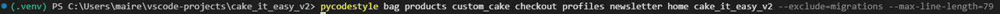


- **Representative files:**
  Screenshots below demonstrate validation across key areas of the project:
  - Settings: 
  - Project URLs: 
  - Home views: 
  - Products models: 
  - Custom Cake models: 
  - Products views: 
  - Custom Cake views: 
  - Checkout models: 
  - One tests file (example): 

---

## HTML Validation (W3C)

All key user-facing templates were validated using the **W3C Nu HTML Checker**.

### Tool Used
- **Nu HTML Checker**: https://validator.w3.org/nu/
- Validation method: *Text input* (HTML source copied from rendered pages)

### Issues Encountered & Resolutions
During initial validation, the following issues were identified and resolved:

- `aria-labelledby` / `aria-label` incorrectly applied to generic `<div>` elements  
  → Fixed by moving ARIA attributes to appropriate interactive elements or removing them where unnecessary.
- Skipped heading levels (e.g. `h1` → `h5`)  
  → Corrected to ensure a logical and accessible heading hierarchy.
- Self-closing syntax warnings on void elements  
  → Considered non-blocking HTML5 warnings (generated by templates) and documented as acceptable.

After these fixes, all validated pages returned **no HTML errors** (only non-critical warnings where noted).

### Pages Validated (Clean Pass)

- **Home page**  
  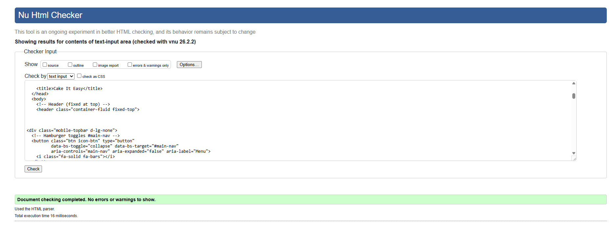

- **Product listings (Cakes & Accessories)**  
  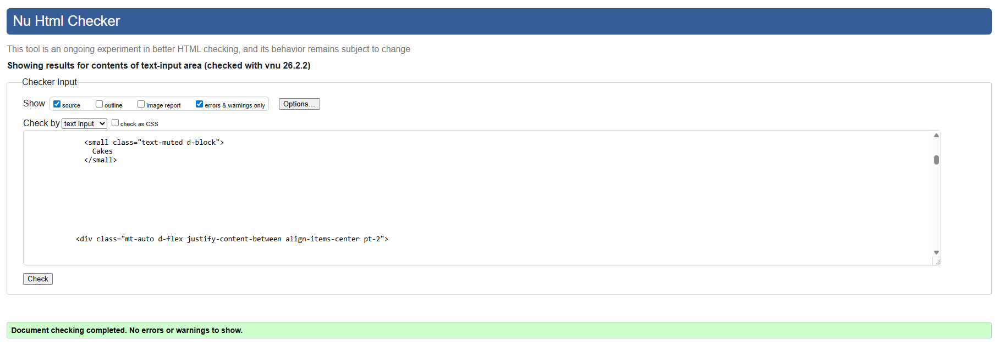  
  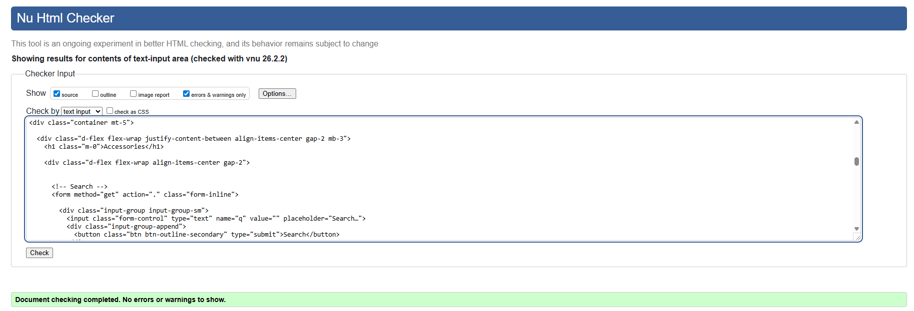

- **Product detail pages**  
  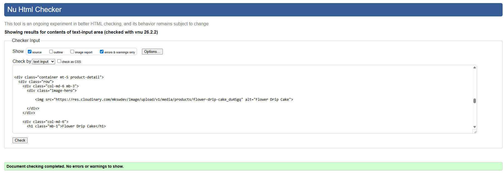

- **Shopping Bag**  
  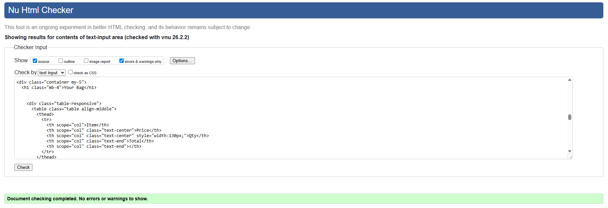

- **Checkout**  
  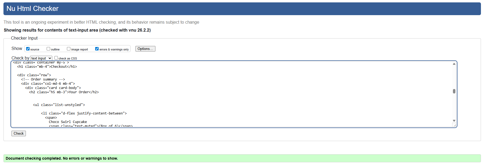

- **Custom Cake form**  
  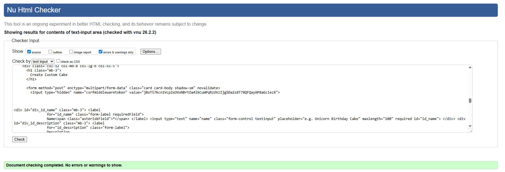

- **About page**  
  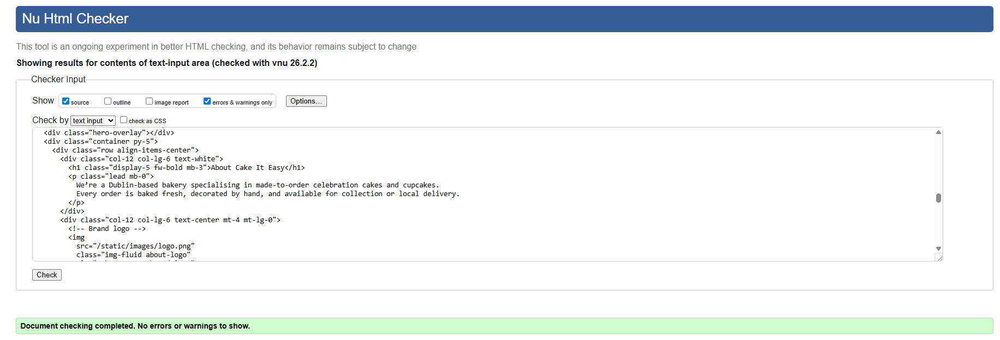

- **404 Error page**
  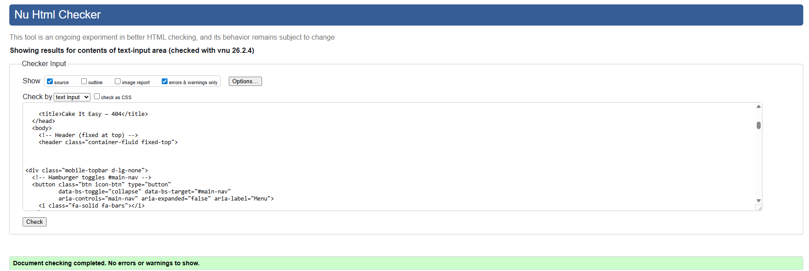

- **Newsletter signup modal**
  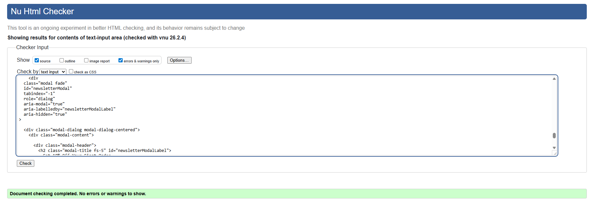


### Result
✔ All tested HTML pages pass W3C validation with **no HTML errors**.

---

## CSS Validation (Jigsaw)

All custom CSS was validated using the **W3C Jigsaw CSS Validator**.

### Tool Used
- **W3C Jigsaw CSS Validator**: https://jigsaw.w3.org/css-validator/
- Validation method: *Direct input / TextArea* (contents of `base.css`)

### Result
✔ CSS validation completed with **no errors**.

### Warnings (9) and Notes

The validator returned the following **warnings only** (no errors). These do not prevent the site from functioning correctly and are acceptable for submission:

- `clip` is deprecated (line 47)  
  - This is typically associated with accessibility patterns (e.g., visually-hidden helper styles) and/or framework-generated CSS.  
  - No change was made as it does not break styling and remains widely supported.

- “Same color for background-color and border-color” on button classes (lines 638, 645, 659, 667)  
  - Buttons intentionally use matching background and border colours to keep a consistent UI style.  
  - No change was required because this is expected and does not indicate a functional issue.

**Warnings list (as reported by Jigsaw):**
- The property `clip` is deprecated
- `.btn-primary`: Same color for background-color and border-color
- `.btn-primary:focus`: Same color for background-color and border-color
- `.btn-primary:active`: Same color for background-color and border-color
- `.btn-primary:hover`: Same color for background-color and border-color
- `.btn-outline-primary:active`: Same color for background-color and border-color
- `.btn-outline-primary:hover`: Same color for background-color and border-color
- `.btn-success`: Same color for background-color and border-color
- `.btn-success:focus`: Same color for background-color and border-color

**Evidence:**
- 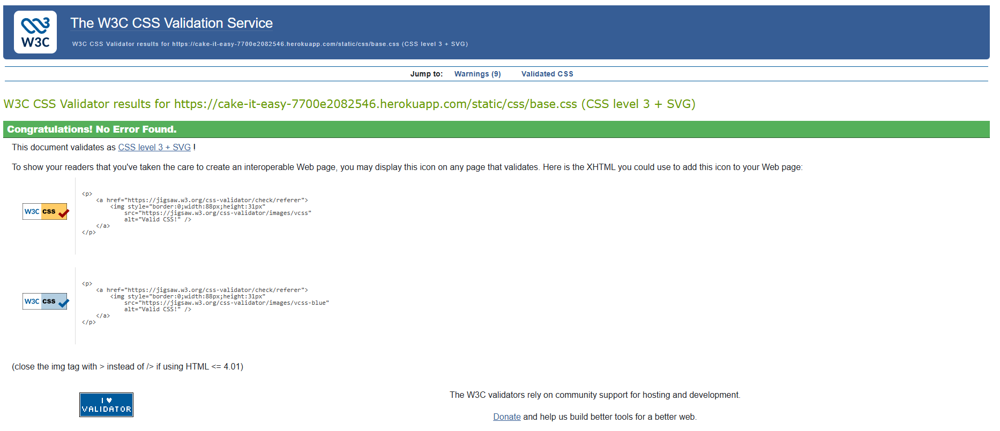


---

## Lighthouse Audits

Lighthouse audits were conducted using **Google Chrome DevTools** on both **desktop and mobile** viewports to evaluate the following areas:

- Performance  
- Accessibility  
- Best Practices  
- SEO  

Audits were performed on a representative selection of **public-facing pages** as well as **transactional pages** (Bag and Checkout) to provide realistic coverage of the application.

---

### Desktop Lighthouse Results

| Page | Performance | Accessibility | Best Practices | SEO |
|-----|------------|---------------|----------------|-----|
| Home | 97 | 100 | 92 | 100 |
| Cakes listing | 67 | 91 | 96 | 100 |
| Accessories listing | 84 | 91 | 96 | 100 |
| Custom Cake | 98 | 100 | 96 | 100 |
| About | 97 | 100 | 92 | 100 |
| Bag | 83 | 91 | 96 | 66 |
| Checkout | 93 | 100 | 96 | 66 |

**Evidence:**

- 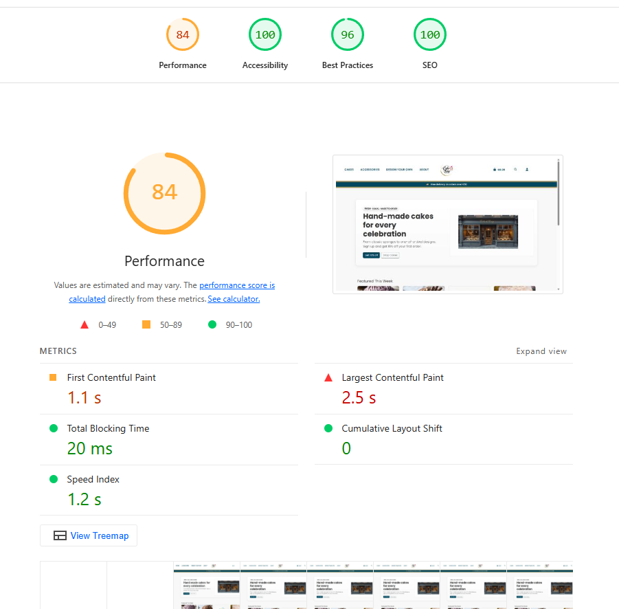
- 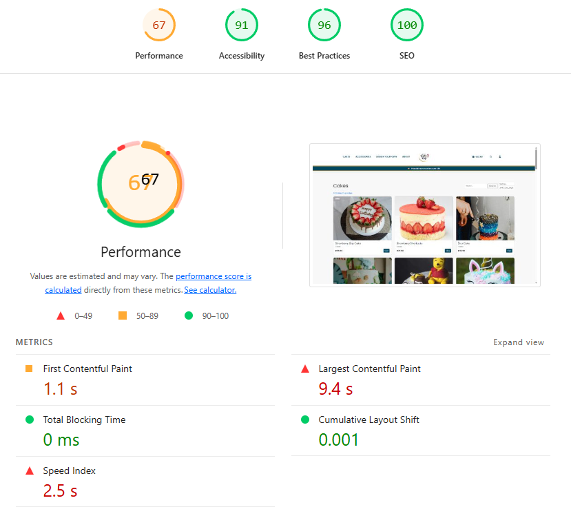
- 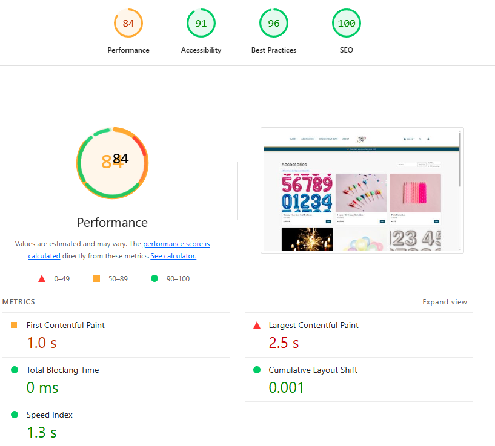
- 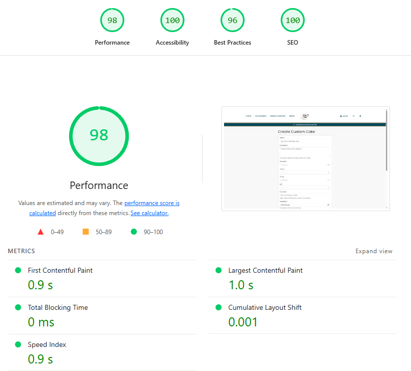
- 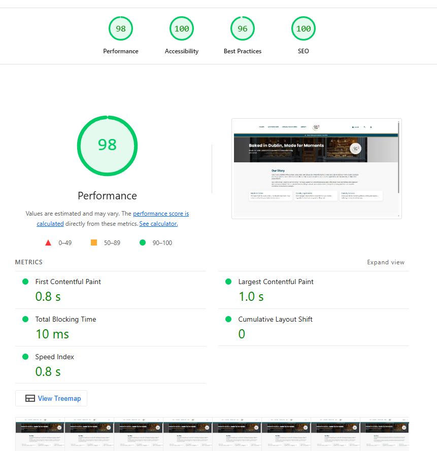
- 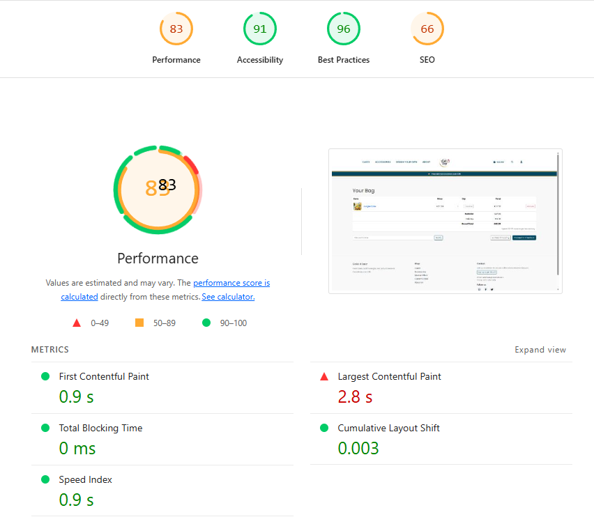
- 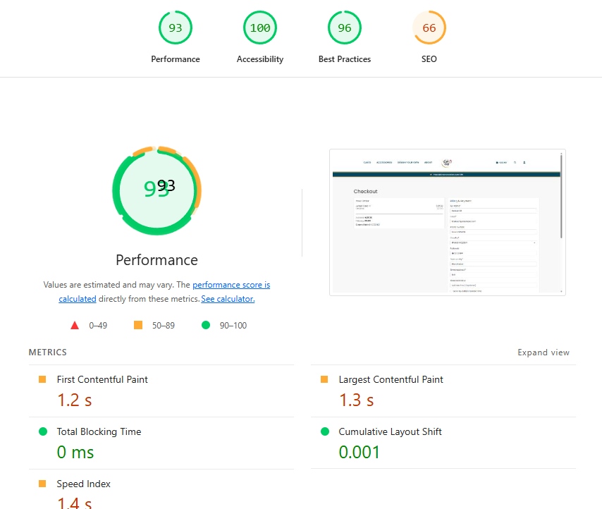

---

### Mobile Lighthouse Results

| Page | Performance | Accessibility | Best Practices | SEO |
|-----|------------|---------------|----------------|-----|
| Home (mobile) | 75 | 100 | 96 | 100 |
| Custom Cake (mobile) | 80 | 100 | 96 | 100 |

**Evidence:**

- 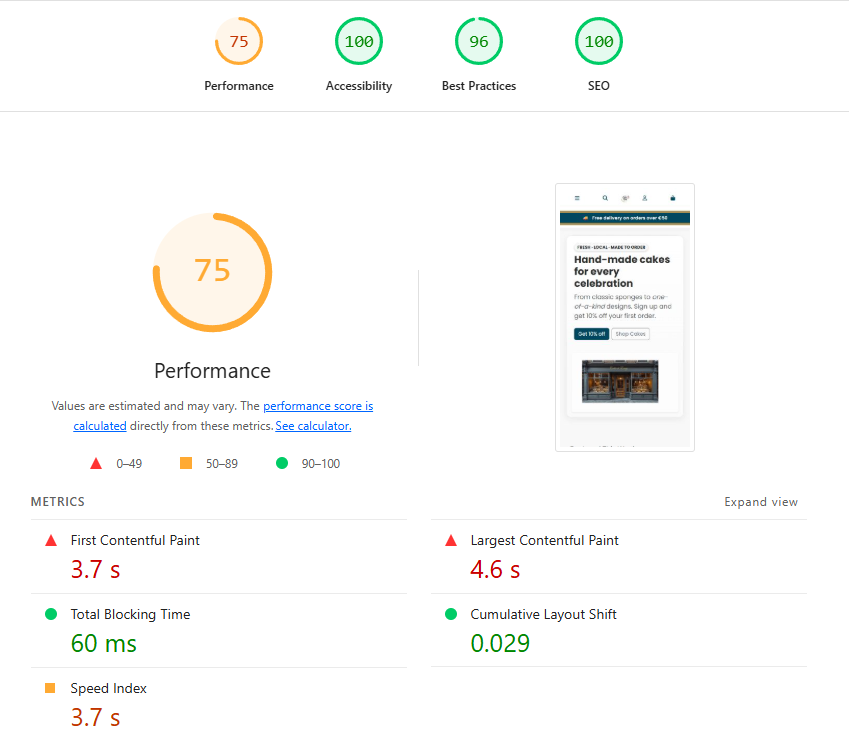
- 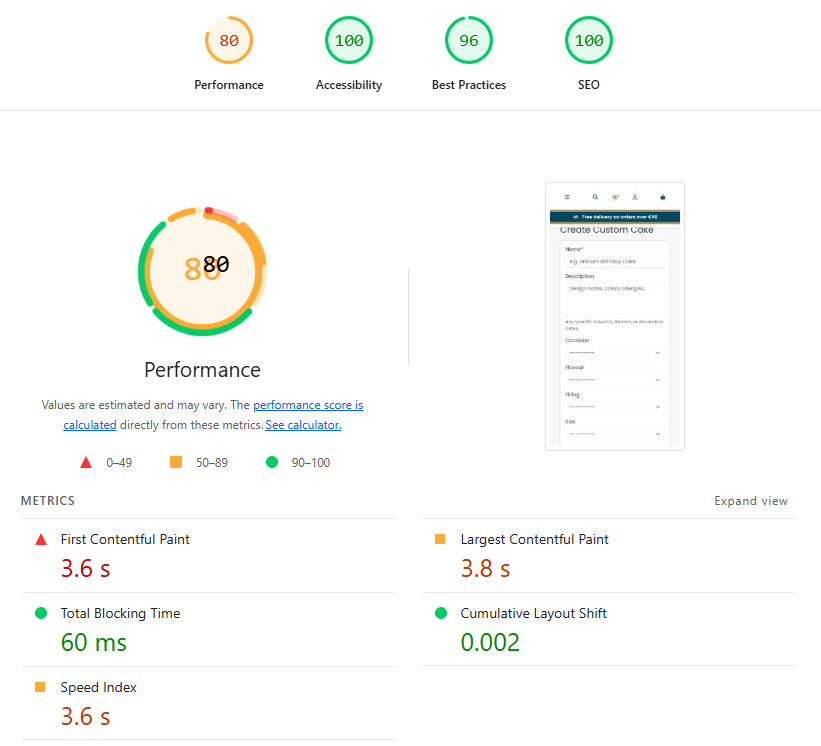

---

### Notes on SEO Scores for Bag & Checkout

The **Bag** and **Checkout** pages returned lower SEO scores (~66). This is **expected and acceptable**, as:

- These pages are **transactional**, not content-focused
- They are intentionally **excluded from indexing** via `robots.txt`
- Checkout flows typically contain limited crawlable content
- Best practice is **not to optimise checkout pages for search engines**

Despite the lower SEO score, both pages:
- Use valid semantic HTML
- Meet accessibility requirements
- Follow industry best practices for secure e-commerce flows

---

### Overall Assessment

- Accessibility scores are consistently high across all tested pages
- Best Practices scores remain strong
- Performance varies depending on page complexity and image content, which is expected
- SEO is fully optimised for all **public content pages**

✔ Lighthouse testing demonstrates a **well-optimised, accessible, and standards-compliant application**.


---

## Browser & Device Compatibility

Cross-browser and device testing was carried out to ensure consistent behaviour, layout, and functionality across commonly used browsers and screen sizes.

### Browsers Tested

| Browser | Version | Result |
|-------|--------|--------|
| Google Chrome | Latest | Pass |
| Mozilla Firefox | Latest | Pass |
| Microsoft Edge | Latest | Pass |

All core functionality (navigation, product browsing, bag, checkout, forms, and authentication) worked as expected across all tested browsers.

### Device & Viewport Testing

| Device / Viewport | Method | Result |
|------------------|--------|--------|
| Desktop / Laptop | Native browser | Pass |
| Mobile | Chrome DevTools emulation | Pass |

Responsive layouts adapted correctly across screen sizes, with no loss of functionality.

### Notes

- Mobile testing was performed using Chrome DevTools device emulation.
- Minor performance variations between browsers are expected and acceptable.
- No browser-specific bugs were identified.

✔ The application is compatible with modern browsers and responsive across common devices.


---

## Known Issues / Out‑of‑Scope
- Newsletter/stub pages may be linked to About or removed to avoid 404s.  
- Advanced product filters and marketing integrations are **out of scope**.

| Issue | Impact | Status |
|------|-------|--------|
| Mobile bag table requires horizontal scrolling to view all columns | Minor UX issue on small screens; functionality unaffected | Documented for future improvement |

**Notes:**  
On mobile devices, the bag table layout can require horizontal scrolling to view all columns simultaneously. Core functionality (viewing items, updating quantities, applying discounts, and completing checkout) remains fully operational.  
A future enhancement would replace the table layout with a card-based mobile design or selectively hide columns for small viewports.


---
## Evidence Index (Assessor-critical)

- Manual test: internal links & logo navigation  
  → docs/readme/01_home_nav_footer.png

- Manual test: empty bag totals (no delivery applied)  
  → docs/readme/15_bag_line.png

- Manual test: RBAC – non-staff blocked from admin CRUD  
  → docs/readme/admin_orders_list.png

- Manual test: admin CRUD – product edit/delete  
  → docs/readme/24_admin_product_options.png

- Manual test: checkout success page with order number  
  → docs/readme/22_checkout_success_page.png

- Manual test: order marked paid via admin (paid checkbox / bulk action)  
  → docs/readme/admin_order_paid_checked.png  
  → docs/readme/admin_mark_paid.png

- Deployed: static assets load correctly in production  
  → docs/readme/01_home_nav_footer.png

- Deployed: DEBUG off & custom 404 page shown  
  → docs/readme/26_404_page.png

- SEO: robots.txt and sitemap.xml accessible  
  → docs/readme/28_robots.png  
  → docs/readme/28_sitemap.png

- Manual test: discount removed after login (single-use enforcement)  
  → docs/readme/discount_removed_after_login.png


## Production Parity Checks (Deployed vs Local)

- Deployed site loads CSS and images correctly (no missing static assets).
- Checkout works end-to-end on deployed site.
- DEBUG is disabled in production and custom 404 page is shown.
