# TESTING.md

## Overview
This project uses **automated tests**, a concise **manual test matrix**, and **validator evidence**.  
All screenshots are stored in:

- Python (PEP8/pycodestyle): `docs/testing/py/`
- HTML (W3C): `docs/testing/html/`
- CSS (Jigsaw): `docs/testing/css/`
- JavaScript (ESLint): `docs/testing/js/`

**Naming convention:** screenshots are saved as `val_<path-with-slashes-replaced-by-underscores>.png`.  
Example: `products/views.py` → `docs/testing/py/val_products_views.png`.

---

## Automated Tests
**Run:** `python manage.py test` → **OK (all green)**

- `bag/tests/test_views.py` – render + add/adjust/remove
- `products/tests/test_rbac.py` – non‑staff blocked on product CRUD
- `custom_cake/tests.py` – create/update/delete; invalid create message; update persists name

**Evidence:**

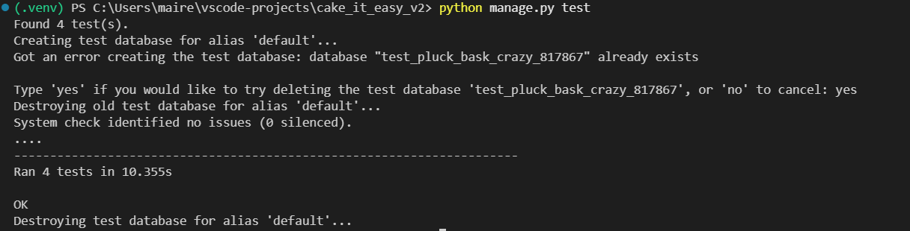

> If you captured a different filename for the green test run, update the image path above accordingly.

---

## Manual Test Matrix
| Area | Scenario | Steps | Expected |
|---|---|---|---|
| Products | View list | Visit `/products/` | Grid renders; links work |
| Products | Detail | Open a product | Add‑to‑bag visible; price shown |
| Bag | Add item | From detail, add qty 1 | Toast + bag count updates |
| Bag | Adjust qty/remove | On `/bag/` change qty/remove | Totals recalc; threshold messaging updates |
| Discount reuse | Attempt to apply WELCOME10 after prior successful checkout | Discount blocked with user-facing message | Pass |
| Checkout | Payment | Card `4242 4242 4242 4242` + valid form | Success page shows **order number** |
| Webhook | Mark paid | Stripe Events shows delivered | Order flips to `paid=True` |
| Profile | Save defaults | Update and submit | Success message; values persist |
| Admin – Order management | Mark order as paid/unpaid | Order status updates correctly | Pass |
| Orders | History | `/checkout/orders/` | Orders list shows recent order |
| Orders | Detail (owner‑only) | Open `/checkout/orders/<id>/` | Owner/staff can view; others denied |
| Custom Cake | Create valid | Minimal required fields | Redirect to detail; success message |
| Custom Cake | Create invalid | Past **Needed for** date | Validation error shown |
| Custom Cake | Update | Change name | Saved; detail shows updated name |
| Custom Cake | Delete | Confirm delete | Redirect to list; message contains “deleted successfully” |
| RBAC | Hide admin links | As non‑staff | No product edit/delete links |
| RBAC | Block admin routes | Hit edit URL as non‑staff | Redirect/403 |
| Auth | Login/Signup | Use valid/invalid | Errors shown; success redirects |
| Auth | Logout | Confirm via card | Session cleared; redirected |
| Allauth UI | Forms layout | Login/Signup/Reset/Logout | Centered card; **Cancel** buttons present |
| SEO/404 | 404 page | Bad URL with `DEBUG=False` | Branded 404 |
| Footer | Sticky footer | Short page (e.g., logout) | Footer sticks to bottom |

_Evidence_: Drop relevant screenshots per row into `docs/testing/html/` or `docs/testing/py/` as appropriate and embed inline beneath the table if desired.

---

## Validation

### Python (PEP8 / pycodestyle @ 79 cols)
- **Tools:** `pycodestyle` (79-char line length), assisted by `ruff format` (line-wrapping) where needed.
- **Whole-project report:**
  

- **Representative files:**
  
  - Settings: 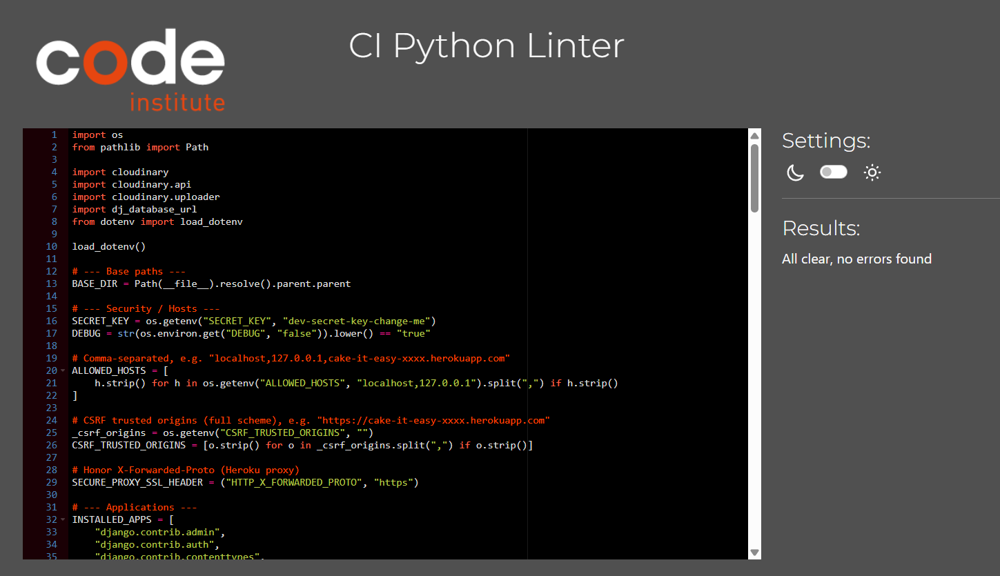
  - Project URLs: 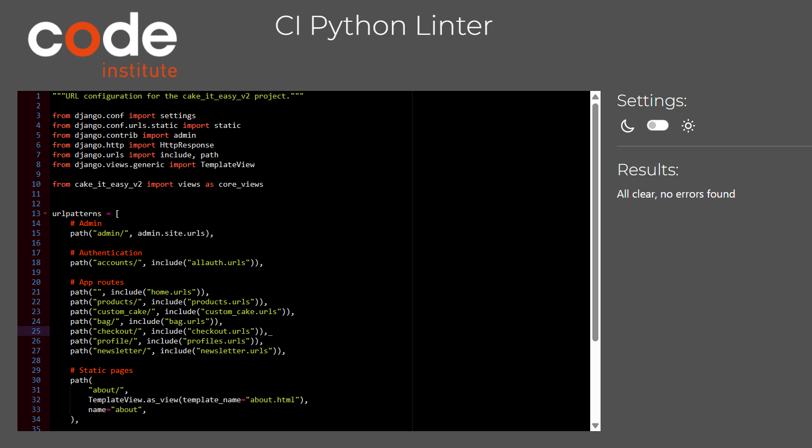
  - Home views: 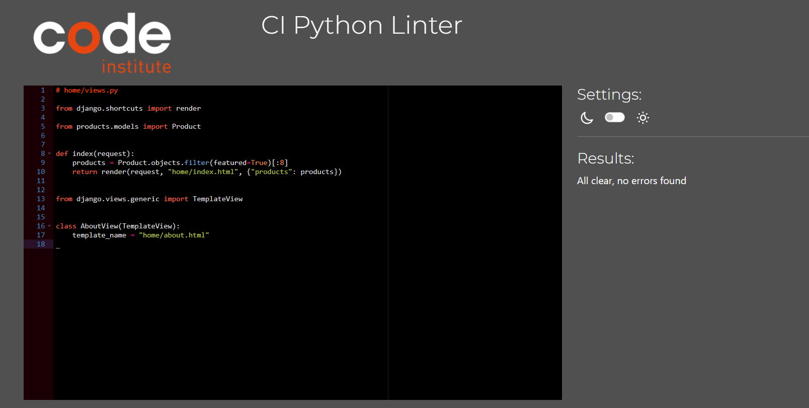
  - Products models: 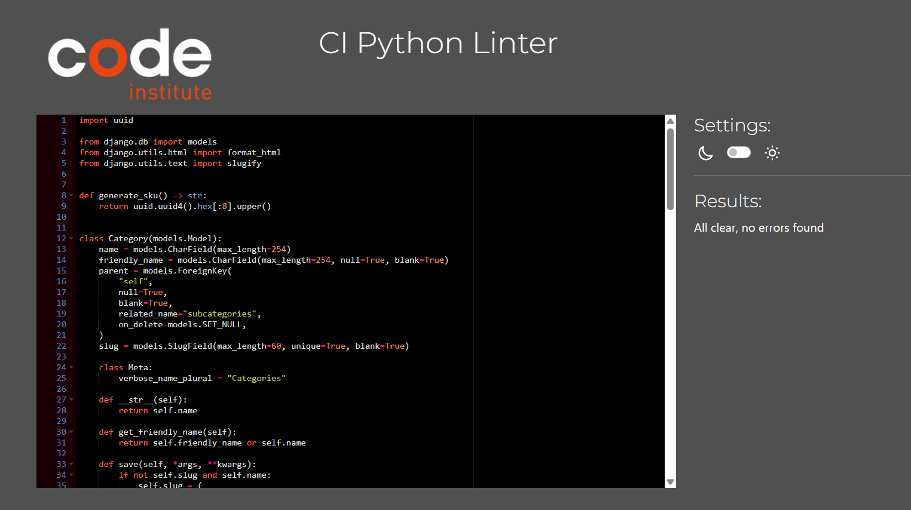
  - Custom Cake models: 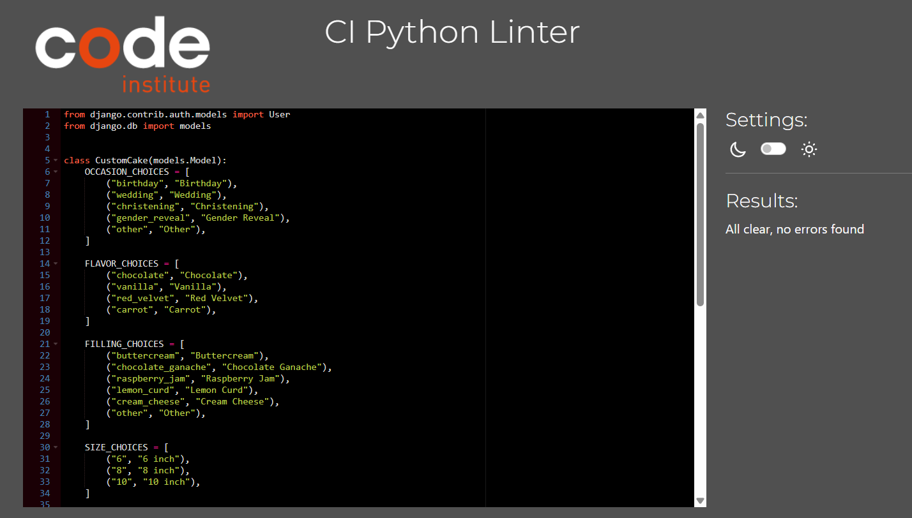
  - Products views: 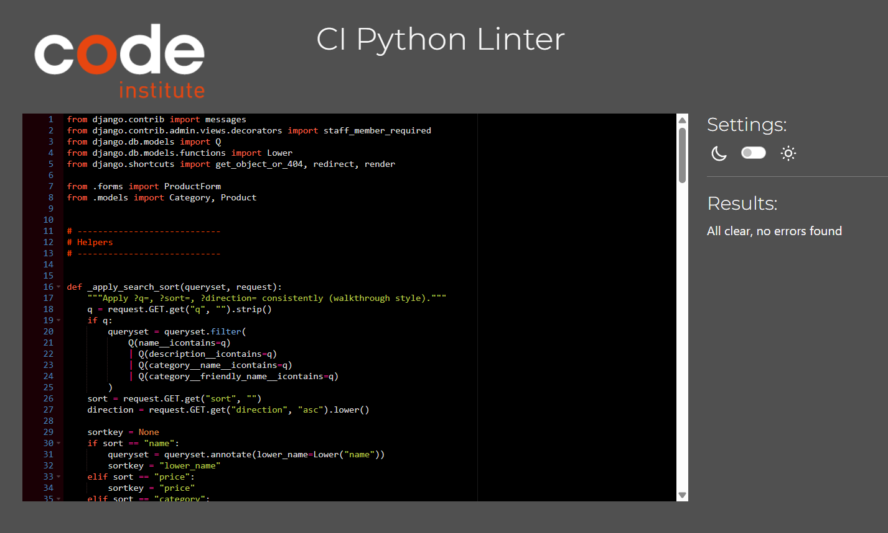
  - Custom Cake views: 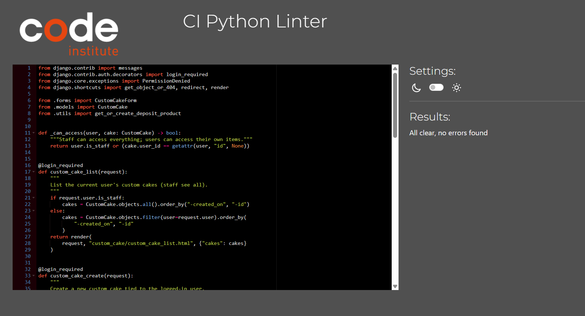
  - Checkout models: 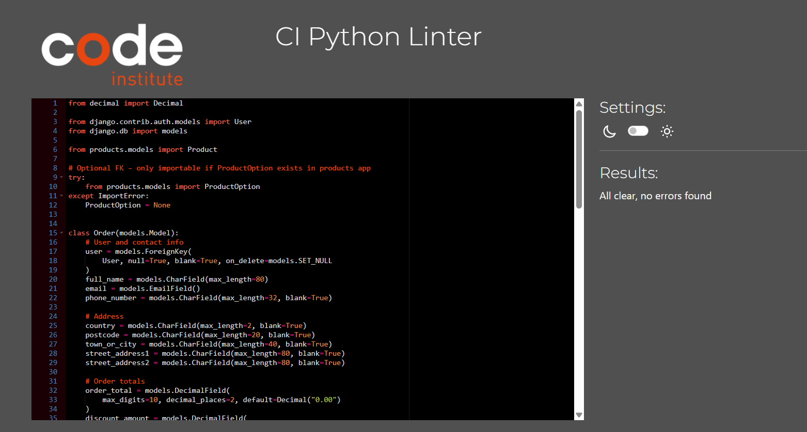
  - One tests file (example): 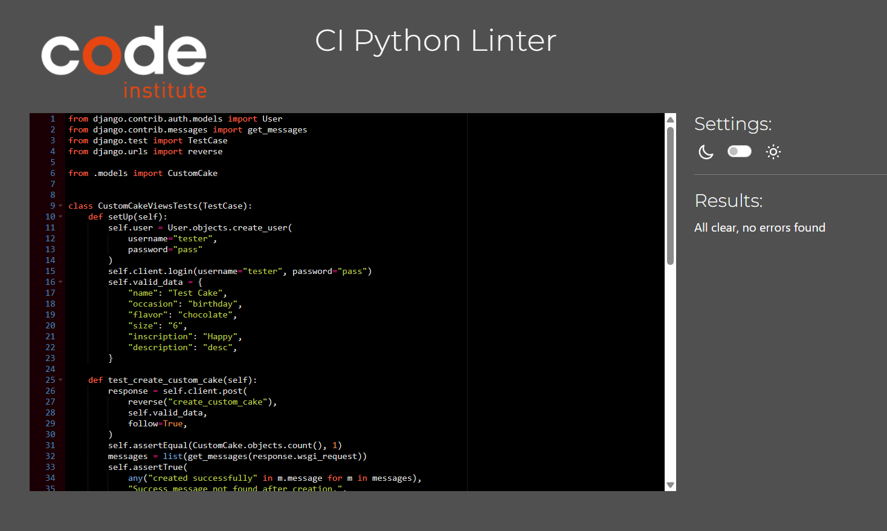

---

### HTML (W3C Validator)
- **Tools:** https://validator.w3.org/ (Validate by URL or by direct input).
- **Key templates:**

  - Base layout: 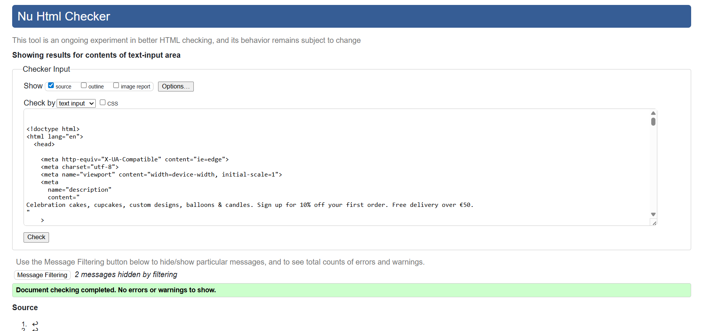
  - Products list: 
  - Products detail: 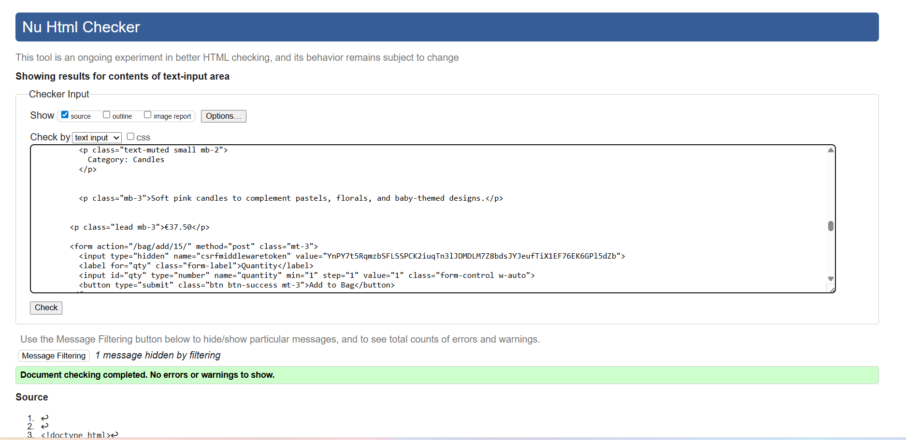
  - Checkout page: 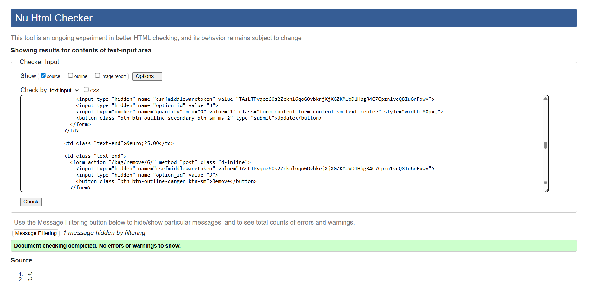
  - 404 page: 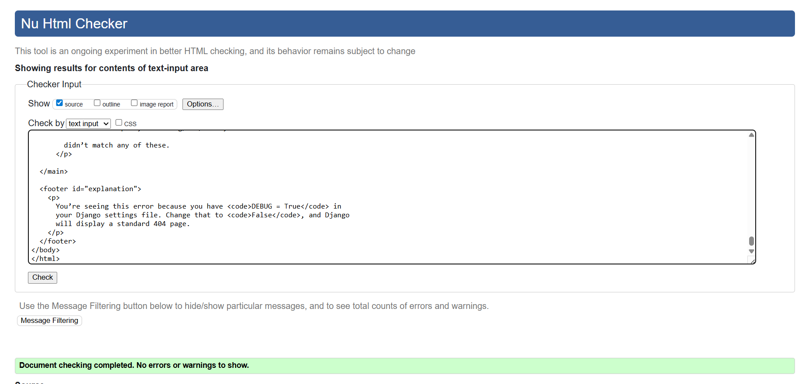

> Add more template screenshots as needed using the same naming convention, e.g. `val_templates_account_login.png` for Allauth.

---

### CSS (Jigsaw Validator)
- **Tools:** https://jigsaw.w3.org/css-validator/
- **Stylesheets:**

  - Base stylesheet: 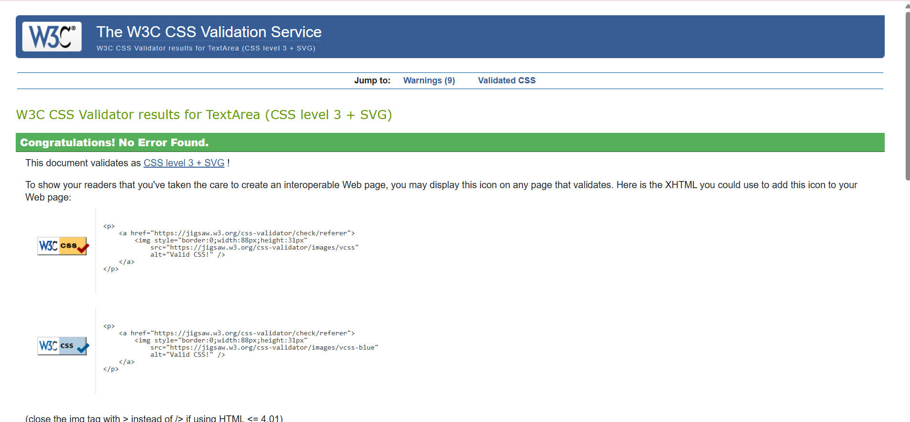
  - (Optional) Additional CSS: 

---

### Lighthouse (Performance / Accessibility / Best Practices / SEO)

We ran Lighthouse in **Chrome DevTools** for both **Desktop** and **Mobile** on key pages.

**How to reproduce**
1. Open page in Chrome → `F12` → **Lighthouse** tab.
2. Categories: Performance, Accessibility, Best Practices, SEO.
3. Run once for **Mobile**, then switch to **Desktop** and run again.
4. Save reports as screenshots (below).

**Results (screenshots)**

| Page | Desktop | Mobile |
|---|---|---|
| Home | 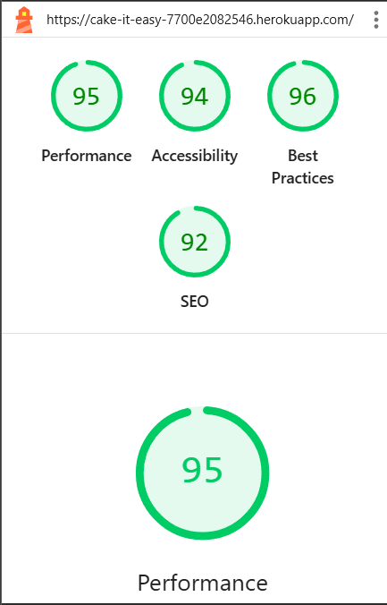 |  |
| Products list | 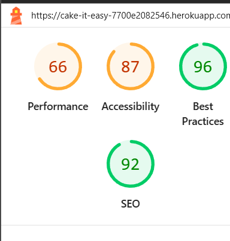 |  |

> If you rename files later (e.g., fix `moblile` → `mobile`), update the paths above accordingly.

---

## Browser & Device Coverage
- Chrome, Firefox, Edge, Safari  
- iOS Safari/Chrome, Android Chrome  
- Responsive checks at 360px, 768px, 1024px, 1440px

_Evidence (optional)_: `docs/testing/html/val_responsive_checks.png`

---

## Known Issues / Out‑of‑Scope
- Newsletter/stub pages may be linked to About or removed to avoid 404s.  
- Advanced product filters and marketing integrations are **out of scope**.
### Known Issues

| Issue | Impact | Status |
|------|-------|--------|
| Mobile bag table requires horizontal scrolling to view all columns | Minor UX issue on small screens; functionality unaffected | Documented for future improvement |

**Notes:**  
On mobile devices, the bag table layout can require horizontal scrolling to view all columns simultaneously. Core functionality (viewing items, updating quantities, applying discounts, and completing checkout) remains fully operational.  
A future enhancement would replace the table layout with a card-based mobile design or selectively hide columns for small viewports.

---

## Evidence Index (Examples)
- Python clean run: `docs/testing/py/val_py_project_clean.png`
- Python reps: `docs/testing/py/val_cake_it_easy_v2_settings.png`, `val_products_models.png`, `val_products_views.png`, `val_custom_cake_models.png`, `val_custom_cake_views.png`, `val_checkout_models.png`, `val_custom_cake_tests.png`
- HTML: `docs/testing/html/val_templates_base.png`, `val_templates_products_product_list.png`, `val_templates_products_product_detail.png`, `val_templates_checkout_checkout.png`, `val_templates_404.png`
- CSS: `docs/testing/css/val_static_css_base.png`
- JS: `docs/testing/js/val_static_js_main.png`